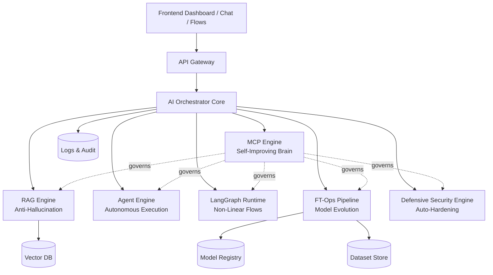
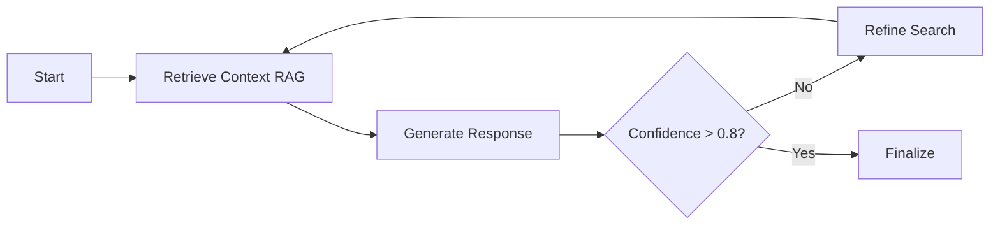

# 🧠 AI ENGINE PLATFORM (MCP-First)

> **A platform for building, operating, auditing, and evolving AI systems autonomously and robustly**


[](https://opensource.org/licenses/MIT)
[]()

## 🎯 Vision

AI Engine Platform is not just another chatbot. It's a **cognitive infrastructure platform** that enables:

- ✅ **RAG without hallucination** - Citation-backed, auditable responses
- ✅ **Autonomous agent orchestration** - Goal-driven execution with self-correction
- ✅ **Non-linear workflows** - Complex decision trees via LangGraph
- ✅ **Self-improving prompts** - Meta-Circular Prompting (MCP) as the core brain
- ✅ **Automated fine-tuning** - FT-Ops pipeline for continuous model evolution
- ✅ **Enterprise-grade security** - Defensive testing with auto-correction
- ✅ **Full auditability** - Debug, governance, and compliance built-in

> **This is OpenAI/Anthropic/DeepMind-level engineering for AI systems.**

---

## 🏗️ Architecture Overview



---

## 🔥 Core Components

### 1️⃣ MCP Engine - The Brain

**Meta-Circular Prompting** is the central nervous system that governs everything:

- 🧠 **Self-improving prompts** - Automatically refines based on feedback
- 🎯 **Controls RAG strategies** - Adjusts chunking, retrieval, and ranking
- 🤖 **Governs agent behavior** - Optimizes agent prompts and tools
- 🔄 **Manages LangGraph flows** - Evolves graph nodes and conditions
- 📊 **Triggers FT-Ops** - Decides when and how to fine-tune models

**MCP Cycle:**

```
Input → Current Prompt → Execution → Result → Evaluation → Refined Prompt → Registry
```

[📖 Read more: MCP Engine Documentation](./docs/components/mcp-engine.md)

---

### 2️⃣ RAG Engine - Truth Without Hallucination

**Retrieval-Augmented Generation** with enterprise-grade controls:

- 📚 **Semantic chunking** - Context-aware document splitting
- 🔍 **Citation engine** - Every claim is traceable
- 📊 **Confidence scoring** - Quantified reliability (0.0-1.0)
- 🛡️ **Anti-hallucination validation** - Blocks unsupported claims

**Output Format:**

```json
{
  "resposta": "...",
  "citations": ["doc1.pdf:p5", "doc2.md:L42"],
  "confidence": 0.91
}
```

[📖 Read more: RAG Engine Documentation](./docs/components/rag-engine.md)

---

### 3️⃣ Agent Engine - Autonomous Execution

**Goal-driven agents** that execute complex tasks:

- 🎯 **Objective-based** - Not chatbots, but task executors
- 🔧 **Tool-equipped** - RAG, code execution, API calls
- 🔄 **Self-correcting** - Validates output and retries
- 📝 **Auditable** - Every action is logged

**Example Agent:**

```python
objective = "Create technical documentation for legacy system"
agent.execute()
# → Searches docs (RAG)
# → Analyzes code
# → Generates outline
# → Writes documentation
# → Validates with auditor
```

[📖 Read more: Agent Engine Documentation](./docs/components/agent-engine.md)

---

### 4️⃣ LangGraph Runtime - Non-Linear Intelligence

**State machine for complex AI workflows:**

- 🔄 **Loops and retries** - Handle failures gracefully
- 🌳 **Conditional branching** - Dynamic decision trees
- 📊 **State management** - Track context across nodes
- 🧠 **MCP-governed** - Graphs evolve based on performance

**Example Flow:**



[📖 Read more: LangGraph Runtime Documentation](./docs/components/langgraph-runtime.md)

---

### 5️⃣ FT-Ops Pipeline - Model Evolution

**Automated fine-tuning operations:**

- 📊 **Automatic dataset curation** - From interaction logs
- 🔄 **Version control** - Model registry with rollback
- 📈 **Performance tracking** - Before/after metrics
- 🎯 **MCP-triggered** - Trains when patterns emerge

**Pipeline:**

```
Logs → Curation → Dataset → Fine-Tuning → Evaluation → Deployment
```

[📖 Read more: FT-Ops Pipeline Documentation](./docs/components/ft-ops-pipeline.md)

---

### 6️⃣ Defensive Security Engine - Auto-Hardening

**Continuous security testing WITHOUT real attacks:**

- 🛡️ **OWASP Top 10 coverage** - SQL injection, XSS, broken auth, etc.
- 🔍 **Static + Dynamic analysis** - SAST + DAST-lite
- 🤖 **Auto-fix generation** - Creates PRs for vulnerabilities
- 📊 **Security maturity scoring** - Track improvement over time

**Safe Testing Approach:**

```python
# ✅ Tests defensive controls (safe)
def test_database_layer_is_parameterized(db_client):
    queries = db_client.get_recent_queries()
    for q in queries:
        assert q.is_parameterized is True

# ❌ Never executes real exploits
```

[📖 Read more: Defensive Security Engine Documentation](./docs/security/defensive-security-engine.md)

---

## 🖥️ Dashboard Features

### 🎛️ Control Panels

| Panel | Purpose |
|-------|---------|
| **Prompt Control** | MCP history, version diffs, improvement metrics |
| **RAG Manager** | Document upload, chunking visualization, citations |
| **Agent Builder** | Define objectives, tools, limits, and costs |
| **LangGraph Designer** | Visual flow editor with loops and conditions |
| **FT-Ops Console** | Dataset management, training runs, rollback |
| **Security Dashboard** | Vulnerability tracking, OWASP compliance, auto-fixes |

[📖 Read more: Dashboard Documentation](./docs/features/dashboard.md)

---

## 🚀 Roadmap

### Phase 1 - Core Foundation

- [x] MCP Engine
- [x] RAG anti-hallucination
- [x] Logs + Auditor
- [ ] Basic API Gateway

### Phase 2 - Intelligence Layer

- [ ] Agent Engine (simple agents)
- [ ] LangGraph Runtime
- [ ] Auto-correction loops

### Phase 3 - Evolution

- [ ] FT-Ops dataset pipeline
- [ ] Fine-tuning automation
- [ ] Model registry

### Phase 4 - Enterprise SaaS

- [ ] Multi-tenant architecture
- [ ] Billing integration
- [ ] Role-based access control (RBAC)
- [ ] Advanced observability

[📖 Read more: Implementation Roadmap](./docs/roadmap.md)

---

## 📚 Documentation

- [Architecture Deep Dive](./docs/architecture.md)
- [Component Documentation](./docs/components/)
- [Security & Compliance](./docs/security/)
- [API Reference](./docs/api/)
- [Deployment Guide](./docs/deployment/)
- [Contributing Guidelines](./CONTRIBUTING.md)

---

## 🎓 Why This Matters

### Traditional Approach ❌

- Static prompts
- Hallucination-prone RAG
- Isolated agents
- Manual fine-tuning
- Reactive security

### AI Engine Platform ✅

- **Self-improving prompts** via MCP
- **Citation-backed RAG** with confidence scores
- **Orchestrated agents** with governance
- **Automated fine-tuning** based on patterns
- **Proactive security** with auto-correction

> **This is not using AI. This is building systems that build better AI.**

---

## 💼 Portfolio Impact

**How to describe this:**

> "Developed an MCP-first AI platform integrating RAG, autonomous agents, LangGraph, and FT-Ops for self-evolving, auditable AI systems with defensive security testing and auto-correction."

**This demonstrates:**

- ✅ Staff/Principal Engineer thinking
- ✅ System design at scale
- ✅ AI/ML engineering maturity
- ✅ Security-first mindset
- ✅ Product vision

---

## 🛠️ Tech Stack

- **Core:** Python 3.11+
- **LLM Framework:** LangChain / LlamaIndex
- **Vector DB:** Pinecone / Weaviate / Qdrant
- **Orchestration:** LangGraph
- **Model Ops:** MLflow / Weights & Biases
- **Security:** Bandit, Safety, custom SAST/DAST
- **Frontend:** React / Next.js
- **API:** FastAPI
- **Infrastructure:** Docker, Kubernetes

---

## 📄 License

MIT License - See [LICENSE](./LICENSE) for details

---

## 🤝 Contributing

We welcome contributions! Please see [CONTRIBUTING.md](./CONTRIBUTING.md) for guidelines.

---

## 📞 Contact

For questions, reach out via [GitHub Issues](https://github.com/yourusername/ai-engine-platform/issues)

---

**Built with 🧠 by engineers who believe AI systems should improve themselves.**
