# 🏗️ Architecture Deep Dive

> **System design and technical architecture of the AI Engine Platform**

## System Overview

The AI Engine Platform is built as a **microservices architecture** with MCP (Meta-Circular Prompting) as the central orchestrator. Each component is independently scalable while maintaining tight integration through event-driven communication.

---

## High-Level Architecture


---

## Component Architecture

### 1. API Gateway

**Responsibilities:**

- Request routing
- Authentication/Authorization
- Rate limiting
- Request/response transformation
- API versioning

**Technology:**

- FastAPI (Python)
- Redis (rate limiting, caching)
- JWT tokens

**Endpoints:**

```python
# Core endpoints
POST   /api/v1/query              # RAG query
POST   /api/v1/agents/execute     # Execute agent
POST   /api/v1/graphs/run         # Run LangGraph workflow

# MCP endpoints
GET    /api/v1/mcp/prompts        # List prompts
POST   /api/v1/mcp/refine         # Trigger refinement

# Admin endpoints
POST   /api/v1/documents/index    # Index documents
GET    /api/v1/metrics            # Get metrics
```

---

### 2. MCP Engine

**Responsibilities:**

- Prompt version control
- Performance evaluation
- Automatic refinement
- A/B testing
- Cross-component governance

**Data Model:**

```python
class Prompt:
    id: str
    version: int
    template: str
    parent_version: Optional[int]
    created_at: datetime
    metrics: PromptMetrics
    
class PromptMetrics:
    overall_score: float
    hallucination_rate: float
    completion_rate: float
    user_feedback: float
    latency_ms: int
    cost_usd: float
```

**Storage:**

- PostgreSQL (metadata, versions)
- S3 (prompt templates, diffs)

---

### 3. RAG Engine

**Responsibilities:**

- Document ingestion & chunking
- Embedding generation
- Semantic search
- Citation extraction
- Anti-hallucination validation

**Pipeline:**


**Storage:**

- Vector DB (embeddings)
- PostgreSQL (chunk metadata, citations)
- S3 (original documents)

---

### 4. Agent Engine

**Responsibilities:**

- Task decomposition
- Tool orchestration
- Self-correction
- Progress tracking

**Agent Lifecycle:**


**Tools Available:**

- RAG query
- Code execution (sandboxed)
- API calls (external)
- File operations
- Database queries

**Storage:**

- Redis (agent state, task queue)
- PostgreSQL (execution history)

---

### 5. LangGraph Runtime

**Responsibilities:**

- Graph definition & execution
- State management
- Conditional routing
- Loop handling
- Checkpoint/resume

**Graph Structure:**

```python
class GraphNode:
    id: str
    type: NodeType  # llm, tool, condition, human
    prompt_id: Optional[str]  # MCP-managed
    next_nodes: List[str]
    
class GraphEdge:
    from_node: str
    to_node: str
    condition: Optional[Callable]
    
class GraphState:
    variables: Dict[str, Any]
    history: List[NodeExecution]
    checkpoint: Optional[str]
```

**Storage:**

- Redis (runtime state)
- PostgreSQL (graph definitions, execution logs)

---

### 6. FT-Ops Pipeline

**Responsibilities:**

- Dataset curation
- Fine-tuning orchestration
- Model evaluation
- Model registry
- Deployment automation

**Pipeline Stages:**


**Storage:**

- S3 (datasets, models)
- MLflow (experiment tracking)
- PostgreSQL (metadata)

---

### 7. Defensive Security Engine

**Responsibilities:**

- OWASP Top 10 testing
- Static analysis (SAST)
- Dynamic validation (DAST)
- Auto-fix generation
- Security scoring

**Testing Flow:**

```mermaid
graph TB
    Code[Code Commit] --> SAST[Static Analysis]
    Code --> DAST[Dynamic Tests]
    Code --> Policy[Policy Checks]
    
    SAST --> Results[Test Results]
    DAST --> Results
    Policy --> Results
    
    Results --> Pass{All Pass?}
    Pass -->|Yes| OK[✅ Deploy]
    Pass -->|No| Classify[Classify Issues]
    Classify --> AutoFix[Generate Fixes]
    AutoFix --> PR[Create PR]
```



**Storage:**

- PostgreSQL (test results, vulnerabilities)
- Git (auto-fix PRs)

---

## Data Flow

### Query Execution Flow


### MCP Refinement Flow


---

## Scalability

### Horizontal Scaling

| Component | Scaling Strategy | Bottleneck |
|-----------|------------------|------------|
| API Gateway | Load balancer + multiple instances | Network I/O |
| MCP Engine | Single writer, multiple readers | Write contention |
| RAG Engine | Stateless, scale horizontally | Vector DB queries |
| Agent Engine | Task queue + workers | Task complexity |
| LangGraph | Stateless, scale horizontally | State storage |

### Vertical Scaling

| Component | Resource | Scaling Limit |
|-----------|----------|---------------|
| Vector DB | Memory | Embedding count |
| PostgreSQL | CPU/Memory | Query complexity |
| Redis | Memory | State size |

### Caching Strategy

```python
# Multi-layer caching
L1: In-memory (LRU, 100MB)
L2: Redis (1GB, 1 hour TTL)
L3: PostgreSQL (persistent)

# Cache keys
- Embeddings: hash(text) → vector
- RAG results: hash(query + top_k + filters) → response
- Prompts: prompt_id + version → template
```

---

## Security Architecture

### Authentication Flow


### Authorization (RBAC)

```python
# Roles
ROLES = {
    "viewer": ["read"],
    "developer": ["read", "write", "execute"],
    "admin": ["read", "write", "execute", "admin"]
}

# Permissions
@require_permission("execute")
def execute_agent(agent_id: str):
    ...

@require_permission("admin")
def delete_user(user_id: str):
    ...
```

### Data Encryption

- **At rest:** AES-256 (S3, PostgreSQL)
- **In transit:** TLS 1.3
- **Secrets:** HashiCorp Vault / AWS Secrets Manager

---

## Observability

### Logging

```python
# Structured logging
logger.info(
    "rag_query_executed",
    query=query,
    chunks_retrieved=10,
    confidence=0.87,
    latency_ms=1200,
    user_id=user.id,
    trace_id=trace_id
)
```

### Metrics

```python
# Prometheus metrics
rag_query_duration_seconds.observe(1.2)
rag_query_total.labels(status="success").inc()
rag_confidence_score.observe(0.87)
mcp_prompt_version.labels(prompt_id="rag_strategy").set(3.2)
```

### Tracing

```python
# Distributed tracing (Jaeger)
with tracer.start_span("rag_query") as span:
    span.set_tag("query", query)
    
    with tracer.start_span("vector_search", child_of=span):
        chunks = vector_db.search(query)
    
    with tracer.start_span("llm_generation", child_of=span):
        response = llm.generate(chunks)
```

---

## Deployment Architecture

### Development

```yaml
# docker-compose.yml
services:
  api:
    build: ./api
    ports: ["8000:8000"]
  
  postgres:
    image: postgres:15
  
  redis:
    image: redis:7
  
  vector-db:
    image: qdrant/qdrant
```

### Production (Kubernetes)

```yaml
# k8s/deployment.yaml
apiVersion: apps/v1
kind: Deployment
metadata:
  name: ai-engine-api
spec:
  replicas: 3
  selector:
    matchLabels:
      app: ai-engine-api
  template:
    spec:
      containers:
      - name: api
        image: ai-engine-api:v1.0.0
        resources:
          requests:
            memory: "512Mi"
            cpu: "500m"
          limits:
            memory: "2Gi"
            cpu: "2000m"
        env:
        - name: DATABASE_URL
          valueFrom:
            secretKeyRef:
              name: db-credentials
              key: url
```

---

## Disaster Recovery

### Backup Strategy

| Component | Frequency | Retention | Recovery Time |
|-----------|-----------|-----------|---------------|
| PostgreSQL | Hourly | 30 days | < 1 hour |
| Vector DB | Daily | 7 days | < 4 hours |
| S3 | Continuous (versioning) | Indefinite | Immediate |
| Redis | Snapshot every 6h | 7 days | < 30 min |

### Failover


---

## Cost Optimization

### Estimated Monthly Costs (1000 users)

| Service | Usage | Cost |
|---------|-------|------|
| LLM API (GPT-4) | 10M tokens | $300 |
| Vector DB (Pinecone) | 10M vectors | $70 |
| PostgreSQL (RDS) | db.t3.large | $150 |
| Redis (ElastiCache) | cache.t3.medium | $50 |
| S3 | 100GB storage + transfer | $30 |
| Compute (EKS) | 3 nodes t3.xlarge | $450 |
| **Total** | | **~$1,050/month** |

### Optimization Strategies

1. **Caching:** Reduce LLM calls by 60%
2. **Batching:** Reduce embedding costs by 40%
3. **Spot instances:** Reduce compute costs by 50%
4. **Smaller models:** Use GPT-3.5 for non-critical tasks

---

## Future Architecture

### Multi-Region


### Edge Deployment


---

**This architecture is designed for scale, reliability, and continuous evolution.**
