# 🤖 Agent Engine - Autonomous Execution

> **Goal-driven agents that execute complex tasks autonomously**

## Overview

The Agent Engine enables creation of **autonomous AI agents** that can decompose complex objectives into actionable steps, use tools, self-correct, and achieve goals with minimal human intervention.

## Core Concepts

### What is an Agent?

An agent is **not a chatbot**. It's an autonomous executor with:

- 🎯 **Clear objective** - What to achieve
- 🔧 **Tools** - How to achieve it (RAG, code execution, APIs)
- 🧠 **Reasoning** - How to plan and adapt
- 🔄 **Self-correction** - How to recover from failures

### Agent vs. Chatbot

| Chatbot | Agent |
|---------|-------|
| Responds to messages | Executes objectives |
| Stateless | Stateful (tracks progress) |
| Single turn | Multi-step |
| Passive | Proactive |
| No tools | Tool-equipped |

---

## Architecture

```mermaid
graph TB
    Objective[User Objective]
    Planner[Task Planner]
    Executor[Tool Executor]
    Validator[Output Validator]
    Memory[Agent Memory]
    
    Objective --> Planner
    Planner --> Executor
    Executor --> Validator
    Validator -->|Valid| Done[✅ Complete]
    Validator -->|Invalid| Planner
    
    Planner <--> Memory
    Executor <--> Memory
    
    Executor --> RAG[RAG Tool]
    Executor --> Code[Code Execution]
    Executor --> API[API Calls]
    Executor --> File[File Operations]
```



---

## Agent Lifecycle

### 1. Planning Phase

**Decompose objective into steps:**

```python
class TaskPlanner:
    def plan(self, objective: str, context: dict) -> List[Step]:
        """
        Break down objective into executable steps
        
        Uses MCP-governed planning prompt
        """
        planning_prompt = self.mcp.get_prompt("agent_planning")
        
        plan = self.llm.generate(f"""
        Objective: {objective}
        
        Context:
        {context}
        
        Available Tools:
        - rag_query: Search knowledge base
        - execute_code: Run Python code
        - api_call: Call external APIs
        - read_file: Read file contents
        - write_file: Write to file
        
        Create a step-by-step plan to achieve the objective.
        Each step should use one tool.
        
        Format:
        1. [tool_name] Description
        2. [tool_name] Description
        ...
        """)
        
        return self._parse_plan(plan)
```

**Example:**

```python
objective = "Create technical documentation for the authentication system"

plan = [
    Step(1, "rag_query", "Search for authentication code"),
    Step(2, "execute_code", "Analyze code structure"),
    Step(3, "rag_query", "Find related documentation"),
    Step(4, "write_file", "Generate documentation outline"),
    Step(5, "write_file", "Write detailed documentation"),
    Step(6, "rag_query", "Validate against existing docs")
]
```

---

### 2. Execution Phase

**Execute steps sequentially:**

```python
class ToolExecutor:
    def execute_step(self, step: Step, context: AgentContext) -> StepResult:
        """
        Execute a single step using the specified tool
        """
        tool = self.tools[step.tool_name]
        
        # Get tool-specific prompt from MCP
        tool_prompt = self.mcp.get_prompt(f"agent_tool_{step.tool_name}")
        
        # Execute with timeout and error handling
        try:
            with timeout(seconds=step.timeout):
                result = tool.execute(
                    instruction=step.description,
                    context=context,
                    prompt=tool_prompt
                )
            
            return StepResult(
                success=True,
                output=result,
                metadata={"latency_ms": ..., "tokens_used": ...}
            )
        
        except TimeoutError:
            return StepResult(
                success=False,
                error="Execution timeout",
                retry_allowed=True
            )
        
        except Exception as e:
            return StepResult(
                success=False,
                error=str(e),
                retry_allowed=self._is_retryable(e)
            )
```

---

### 3. Validation Phase

**Verify step output:**

```python
class OutputValidator:
    def validate(self, step: Step, result: StepResult) -> ValidationResult:
        """
        Validate step output meets requirements
        
        Checks:
        - Output is not empty
        - Output is relevant to step
        - Output doesn't contain errors
        - Output advances toward objective
        """
        validation_prompt = f"""
        Step: {step.description}
        Expected: {step.expected_output}
        Actual: {result.output}
        
        Is the output valid and complete? (yes/no)
        If no, what's wrong?
        """
        
        validation = self.llm.generate(validation_prompt)
        
        if validation.is_valid:
            return ValidationResult(valid=True)
        else:
            return ValidationResult(
                valid=False,
                reason=validation.reason,
                suggested_fix=validation.fix
            )
```

---

### 4. Self-Correction

**Retry or replan on failure:**

```python
class SelfCorrection:
    def handle_failure(
        self,
        step: Step,
        result: StepResult,
        validation: ValidationResult,
        attempt: int
    ) -> CorrectionAction:
        """
        Decide how to recover from failure
        
        Strategies:
        1. Retry with same parameters (transient errors)
        2. Retry with modified parameters (wrong approach)
        3. Replan (step is impossible)
        4. Ask human (stuck)
        """
        if attempt < 3 and result.retry_allowed:
            # Retry with exponential backoff
            return CorrectionAction(
                action="retry",
                delay_seconds=2 ** attempt
            )
        
        if not validation.valid and validation.suggested_fix:
            # Modify step based on suggestion
            return CorrectionAction(
                action="modify",
                new_step=self._apply_fix(step, validation.suggested_fix)
            )
        
        if attempt >= 3:
            # Replan from this point
            return CorrectionAction(
                action="replan",
                from_step=step.number
            )
        
        # Give up, ask human
        return CorrectionAction(
            action="escalate",
            reason=f"Failed after {attempt} attempts"
        )
```

---

## Agent Tools

### RAG Tool

```python
class RAGTool:
    def execute(self, instruction: str, context: AgentContext) -> str:
        """
        Query knowledge base
        
        Example instruction:
        "Search for authentication implementation details"
        """
        # Extract query from instruction
        query = self._extract_query(instruction)
        
        # Use RAG engine
        response = self.rag_engine.query(
            query=query,
            namespace=context.namespace,
            top_k=10
        )
        
        return f"""
        Answer: {response.answer}
        Confidence: {response.confidence}
        Citations: {response.citations}
        """
```

### Code Execution Tool

```python
class CodeExecutionTool:
    def execute(self, instruction: str, context: AgentContext) -> str:
        """
        Execute Python code in sandboxed environment
        
        Example instruction:
        "Analyze the structure of auth.py and list all classes"
        """
        # Generate code from instruction
        code = self._generate_code(instruction, context)
        
        # Execute in sandbox
        result = self.sandbox.run(
            code=code,
            timeout=30,
            memory_limit_mb=512
        )
        
        return result.stdout
```

### API Call Tool

```python
class APICallTool:
    def execute(self, instruction: str, context: AgentContext) -> str:
        """
        Call external APIs
        
        Example instruction:
        "Get the latest version of the 'requests' package from PyPI"
        """
        # Parse instruction to API call
        api_call = self._parse_api_call(instruction)
        
        # Execute with retry
        response = self.http_client.request(
            method=api_call.method,
            url=api_call.url,
            headers=api_call.headers,
            json=api_call.body,
            timeout=10
        )
        
        return response.json()
```

---

## Agent Memory

**Maintain context across steps:**

```python
class AgentMemory:
    def __init__(self):
        self.short_term = {}  # Current execution
        self.long_term = []   # Past executions
    
    def remember(self, key: str, value: Any):
        """Store in short-term memory"""
        self.short_term[key] = value
    
    def recall(self, key: str) -> Any:
        """Retrieve from short-term memory"""
        return self.short_term.get(key)
    
    def summarize_execution(self) -> str:
        """Summarize current execution for long-term storage"""
        return f"""
        Objective: {self.short_term['objective']}
        Steps Completed: {len(self.short_term['completed_steps'])}
        Outcome: {self.short_term['outcome']}
        Key Learnings: {self.short_term['learnings']}
        """
    
    def save_to_long_term(self):
        """Save execution to long-term memory"""
        summary = self.summarize_execution()
        self.long_term.append({
            "timestamp": datetime.now(),
            "summary": summary,
            "full_trace": self.short_term.copy()
        })
```

---

## MCP Integration

**MCP governs agent behavior:**

```python
class MCPGovernedAgent:
    def execute(self, objective: str) -> AgentResult:
        # Get agent prompts from MCP
        planning_prompt = self.mcp.get_prompt("agent_planning")
        execution_prompt = self.mcp.get_prompt("agent_execution")
        validation_prompt = self.mcp.get_prompt("agent_validation")
        
        # Execute with MCP-governed prompts
        plan = self.planner.plan(objective, planning_prompt)
        results = self.executor.execute(plan, execution_prompt)
        validation = self.validator.validate(results, validation_prompt)
        
        # Feedback to MCP
        self.mcp.record_execution(
            prompt_ids=["agent_planning", "agent_execution", "agent_validation"],
            metrics={
                "success_rate": validation.success_rate,
                "steps_completed": len(results),
                "retries_needed": sum(r.retries for r in results),
                "total_time_seconds": sum(r.duration for r in results)
            }
        )
        
        return AgentResult(
            objective=objective,
            plan=plan,
            results=results,
            validation=validation
        )
```

**MCP Learning Examples:**

```python
# MCP learns: Code analysis often fails, increase timeout
if tool == "execute_code" and task_type == "analysis":
    timeout = 60  # Increased from 30

# MCP learns: RAG queries for code need more chunks
if tool == "rag_query" and domain == "code":
    top_k = 15  # Increased from 10

# MCP learns: File writes need validation step
if tool == "write_file":
    add_step_after("validate_file_content")
```

---

## Example: Documentation Agent

```python
# Define objective
objective = "Create comprehensive API documentation for the user service"

# Create agent
agent = Agent(
    name="DocumentationAgent",
    objective=objective,
    tools=["rag_query", "execute_code", "write_file"],
    max_steps=20,
    timeout_minutes=30
)

# Execute
result = agent.execute()

# Agent's plan (auto-generated):
# 1. [rag_query] Search for user service code
# 2. [execute_code] Analyze API endpoints
# 3. [execute_code] Extract request/response schemas
# 4. [rag_query] Find existing documentation patterns
# 5. [write_file] Generate API reference
# 6. [write_file] Generate usage examples
# 7. [rag_query] Validate against style guide

# Output:
# ✅ Created: docs/api/user-service.md
# ✅ Created: docs/examples/user-service-examples.md
# ✅ Validation: Passed style guide checks
```

---

## Configuration

```yaml
# agent_config.yaml

agents:
  default:
    max_steps: 20
    timeout_minutes: 30
    max_retries_per_step: 3
    
  documentation_agent:
    tools:
      - rag_query
      - execute_code
      - write_file
    constraints:
      max_file_size_mb: 10
      allowed_file_extensions: [".md", ".txt"]
  
  code_analysis_agent:
    tools:
      - rag_query
      - execute_code
    constraints:
      sandbox_memory_mb: 1024
      sandbox_timeout_seconds: 60

tools:
  rag_query:
    timeout_seconds: 10
    max_retries: 2
  
  execute_code:
    sandbox: "docker"
    timeout_seconds: 30
    memory_limit_mb: 512
  
  api_call:
    timeout_seconds: 10
    max_retries: 3
    rate_limit_per_minute: 60
```

---

## Monitoring

### Agent Dashboard

```
🤖 Active Agents: 3

Agent: DocumentationAgent
├─ Objective: Create API documentation
├─ Progress: 5/7 steps (71%)
├─ Current Step: [write_file] Generate usage examples
├─ Time Elapsed: 4m 32s
└─ Status: 🟢 Running

Agent: CodeReviewAgent
├─ Objective: Review PR #142
├─ Progress: 3/5 steps (60%)
├─ Current Step: [rag_query] Check style guide
├─ Time Elapsed: 2m 15s
└─ Status: 🟢 Running

Agent: TestGenerationAgent
├─ Objective: Generate unit tests for auth module
├─ Progress: 8/10 steps (80%)
├─ Current Step: [execute_code] Run generated tests
├─ Time Elapsed: 6m 48s
└─ Status: ⚠️ Retrying (attempt 2/3)
```

### Metrics

| Metric | Value |
|--------|-------|
| Total Agents Executed | 1,247 |
| Success Rate | 87% |
| Avg Steps per Agent | 6.3 |
| Avg Execution Time | 5m 12s |
| Most Used Tool | rag_query (42%) |

---

## API Reference

### Create Agent

```python
POST /api/v1/agents/create

Request:
{
  "name": "DocumentationAgent",
  "objective": "Create API documentation",
  "tools": ["rag_query", "execute_code", "write_file"],
  "context": {
    "namespace": "user-service",
    "style_guide": "docs/style-guide.md"
  }
}

Response:
{
  "agent_id": "agent_123",
  "status": "created"
}
```

### Execute Agent

```python
POST /api/v1/agents/{agent_id}/execute

Response:
{
  "agent_id": "agent_123",
  "status": "running",
  "progress": {
    "current_step": 3,
    "total_steps": 7
  }
}
```

### Get Agent Status

```python
GET /api/v1/agents/{agent_id}

Response:
{
  "agent_id": "agent_123",
  "status": "completed",
  "result": {
    "success": true,
    "output": "Created 2 documentation files",
    "files_created": [
      "docs/api/user-service.md",
      "docs/examples/user-service-examples.md"
    ]
  }
}
```

---

**Agent Engine: Autonomous execution, not just conversation.**
