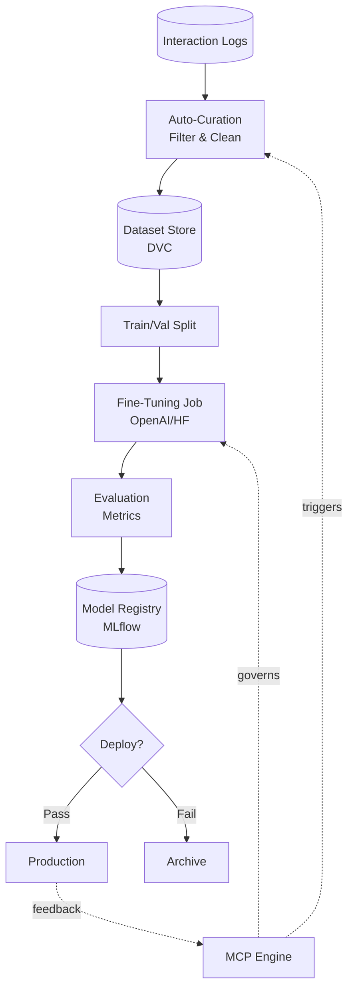

# 🔄 FT-Ops Pipeline - Model Evolution

> **Automated fine-tuning operations for continuous model improvement**

## Overview

FT-Ops (Fine-Tuning Operations) is the **MLOps pipeline** that automatically curates datasets from interaction logs, fine-tunes models, evaluates performance, and deploys improved models—all governed by MCP.

## Why FT-Ops?

### Traditional Approach ❌

- Manual dataset creation
- Ad-hoc fine-tuning
- No version control
- Unclear when to train
- Risky deployments

### FT-Ops ✅

- **Automatic dataset curation** from logs
- **MCP-triggered training** when patterns emerge
- **Version control** for datasets and models
- **Automated evaluation** before deployment
- **Safe rollback** if performance degrades

---

## Architecture



---

## Pipeline Stages

### 1. Interaction Logging

**Capture all AI interactions:**

```python
class InteractionLogger:
    def log_interaction(
        self,
        prompt: str,
        response: str,
        metadata: dict
    ):
        """
        Log every AI interaction
        
        Metadata includes:
        - Task type (e.g., "code_generation", "summarization")
        - User feedback (thumbs up/down, rating)
        - Performance metrics (latency, tokens)
        - Success/failure indicator
        """
        interaction = {
            "id": generate_id(),
            "timestamp": datetime.now(),
            "prompt": prompt,
            "response": response,
            "task_type": metadata.get("task_type"),
            "user_feedback": metadata.get("user_feedback"),
            "success": metadata.get("success", True),
            "confidence": metadata.get("confidence"),
            "latency_ms": metadata.get("latency_ms"),
            "tokens_used": metadata.get("tokens_used")
        }
        
        # Store in database
        self.db.insert("interactions", interaction)
        
        # Also log to file for batch processing
        self.file_logger.append(interaction)
```

---

### 2. Auto-Curation

**MCP triggers curation when patterns emerge:**

```python
class DatasetCurator:
    def should_curate(self, task_type: str) -> bool:
        """
        MCP decides when to curate
        
        Triggers:
        - 100+ successful examples
        - Recurring error pattern
        - User explicitly requests
        """
        count = self.db.count(
            "interactions",
            task_type=task_type,
            success=True,
            user_feedback__gte=4  # 4-5 stars
        )
        
        return count >= 100
    
    def curate_dataset(self, task_type: str) -> Dataset:
        """
        Curate high-quality dataset
        
        Filters:
        - Success = True
        - User feedback >= 4 stars
        - No errors
        - Reasonable length
        - Diverse examples
        """
        # Fetch candidates
        candidates = self.db.query(
            "interactions",
            task_type=task_type,
            success=True,
            user_feedback__gte=4,
            limit=1000
        )
        
        # Apply quality filters
        filtered = []
        for candidate in candidates:
            if self._is_high_quality(candidate):
                filtered.append(candidate)
        
        # Ensure diversity
        diverse = self._ensure_diversity(filtered, target_size=500)
        
        # Format for fine-tuning
        dataset = []
        for interaction in diverse:
            dataset.append({
                "messages": [
                    {"role": "user", "content": interaction["prompt"]},
                    {"role": "assistant", "content": interaction["response"]}
                ]
            })
        
        return Dataset(
            task_type=task_type,
            examples=dataset,
            metadata={
                "created_at": datetime.now(),
                "source": "auto_curated",
                "quality_threshold": 4.0,
                "diversity_score": self._compute_diversity(diverse)
            }
        )
    
    def _is_high_quality(self, interaction: dict) -> bool:
        """Quality checks"""
        # Not too short
        if len(interaction["response"]) < 50:
            return False
        
        # Not too long
        if len(interaction["response"]) > 5000:
            return False
        
        # No error messages
        if "error" in interaction["response"].lower():
            return False
        
        # Reasonable latency
        if interaction["latency_ms"] > 10000:
            return False
        
        return True
    
    def _ensure_diversity(self, examples: List[dict], target_size: int) -> List[dict]:
        """
        Select diverse subset
        
        Uses embedding similarity to avoid redundancy
        """
        embeddings = self.embed([e["prompt"] for e in examples])
        
        # Greedy diversity selection
        selected = [examples[0]]
        selected_embeddings = [embeddings[0]]
        
        for i, (example, embedding) in enumerate(zip(examples[1:], embeddings[1:])):
            # Compute similarity to selected
            similarities = [
                cosine_similarity(embedding, sel_emb)
                for sel_emb in selected_embeddings
            ]
            
            # Add if sufficiently different
            if max(similarities) < 0.9:
                selected.append(example)
                selected_embeddings.append(embedding)
            
            if len(selected) >= target_size:
                break
        
        return selected
```

---

### 3. Dataset Versioning

**Track datasets with DVC:**

```python
class DatasetVersioning:
    def save_dataset(self, dataset: Dataset) -> str:
        """
        Save dataset with version control
        
        Uses DVC (Data Version Control)
        """
        # Save to file
        filename = f"datasets/{dataset.task_type}_{dataset.metadata['created_at']}.jsonl"
        with open(filename, "w") as f:
            for example in dataset.examples:
                f.write(json.dumps(example) + "\n")
        
        # Track with DVC
        os.system(f"dvc add {filename}")
        os.system(f"git add {filename}.dvc")
        os.system(f"git commit -m 'Add dataset for {dataset.task_type}'")
        os.system(f"git tag dataset-{dataset.task_type}-v{self._get_next_version()}")
        os.system("dvc push")
        
        return filename
    
    def load_dataset(self, version: str) -> Dataset:
        """Load specific dataset version"""
        os.system(f"git checkout {version}")
        os.system("dvc pull")
        # ... load dataset
```

---

### 4. Fine-Tuning

**Train models via OpenAI or HuggingFace:**

```python
class FineTuningOrchestrator:
    def train_model(
        self,
        dataset_path: str,
        base_model: str = "gpt-3.5-turbo",
        task_type: str = None
    ) -> TrainingJob:
        """
        Start fine-tuning job
        
        Supports:
        - OpenAI fine-tuning API
        - HuggingFace Trainer
        - Custom training loops
        """
        # Split dataset
        train_data, val_data = self._split_dataset(dataset_path, split=0.8)
        
        # Upload to training platform
        if base_model.startswith("gpt"):
            job = self._train_openai(train_data, val_data, base_model)
        else:
            job = self._train_huggingface(train_data, val_data, base_model)
        
        # Track in MLflow
        with mlflow.start_run():
            mlflow.log_param("base_model", base_model)
            mlflow.log_param("task_type", task_type)
            mlflow.log_param("train_size", len(train_data))
            mlflow.log_param("val_size", len(val_data))
            mlflow.log_artifact(dataset_path)
        
        return job
    
    def _train_openai(self, train_data, val_data, base_model):
        """Fine-tune via OpenAI API"""
        # Upload training file
        train_file = openai.File.create(
            file=open(train_data, "rb"),
            purpose="fine-tune"
        )
        
        # Create fine-tuning job
        job = openai.FineTuningJob.create(
            training_file=train_file.id,
            model=base_model,
            hyperparameters={
                "n_epochs": 3,
                "batch_size": 4,
                "learning_rate_multiplier": 0.1
            }
        )
        
        return TrainingJob(
            id=job.id,
            status="running",
            platform="openai",
            base_model=base_model
        )
    
    def _train_huggingface(self, train_data, val_data, base_model):
        """Fine-tune via HuggingFace"""
        from transformers import Trainer, TrainingArguments
        
        # Load model and tokenizer
        model = AutoModelForCausalLM.from_pretrained(base_model)
        tokenizer = AutoTokenizer.from_pretrained(base_model)
        
        # Prepare datasets
        train_dataset = self._prepare_hf_dataset(train_data, tokenizer)
        val_dataset = self._prepare_hf_dataset(val_data, tokenizer)
        
        # Training arguments
        training_args = TrainingArguments(
            output_dir="./results",
            num_train_epochs=3,
            per_device_train_batch_size=4,
            per_device_eval_batch_size=4,
            warmup_steps=500,
            weight_decay=0.01,
            logging_dir="./logs",
            evaluation_strategy="epoch",
            save_strategy="epoch",
            load_best_model_at_end=True
        )
        
        # Train
        trainer = Trainer(
            model=model,
            args=training_args,
            train_dataset=train_dataset,
            eval_dataset=val_dataset
        )
        
        trainer.train()
        
        return TrainingJob(
            id=generate_id(),
            status="completed",
            platform="huggingface",
            base_model=base_model,
            model_path="./results/best_model"
        )
```

---

### 5. Evaluation

**Validate model before deployment:**

```python
class ModelEvaluator:
    def evaluate(self, model_id: str, test_dataset: str) -> EvaluationResult:
        """
        Evaluate fine-tuned model
        
        Metrics:
        - Task-specific accuracy
        - Perplexity
        - BLEU/ROUGE (for generation)
        - Latency
        - Cost per request
        """
        # Load model
        model = self.load_model(model_id)
        
        # Load test data
        test_data = self.load_dataset(test_dataset)
        
        # Run evaluation
        results = {
            "accuracy": self._compute_accuracy(model, test_data),
            "perplexity": self._compute_perplexity(model, test_data),
            "bleu_score": self._compute_bleu(model, test_data),
            "avg_latency_ms": self._measure_latency(model, test_data),
            "cost_per_1k_tokens": self._estimate_cost(model)
        }
        
        # Compare to baseline
        baseline = self.load_model("baseline")
        baseline_results = self._evaluate_baseline(baseline, test_data)
        
        results["improvement"] = {
            "accuracy": results["accuracy"] - baseline_results["accuracy"],
            "perplexity": baseline_results["perplexity"] - results["perplexity"],
            "latency": baseline_results["avg_latency_ms"] - results["avg_latency_ms"]
        }
        
        # Log to MLflow
        with mlflow.start_run():
            for metric, value in results.items():
                if isinstance(value, (int, float)):
                    mlflow.log_metric(metric, value)
        
        return EvaluationResult(**results)
    
    def should_deploy(self, eval_result: EvaluationResult) -> bool:
        """
        Decide if model should be deployed
        
        Criteria:
        - Accuracy improvement >= 5%
        - No perplexity regression
        - Latency increase < 20%
        """
        if eval_result.improvement["accuracy"] < 0.05:
            return False
        
        if eval_result.improvement["perplexity"] < 0:
            return False
        
        if eval_result.improvement["latency"] > 200:  # ms
            return False
        
        return True
```

---

### 6. Model Registry

**Track all models with MLflow:**

```python
class ModelRegistry:
    def register_model(
        self,
        model_id: str,
        task_type: str,
        eval_result: EvaluationResult,
        metadata: dict
    ):
        """Register model in MLflow"""
        with mlflow.start_run():
            # Log model
            mlflow.log_artifact(model_id)
            
            # Log metrics
            mlflow.log_metrics({
                "accuracy": eval_result.accuracy,
                "perplexity": eval_result.perplexity,
                "latency_ms": eval_result.avg_latency_ms
            })
            
            # Log params
            mlflow.log_params({
                "task_type": task_type,
                "base_model": metadata["base_model"],
                "train_size": metadata["train_size"]
            })
            
            # Register
            mlflow.register_model(
                f"runs:/{mlflow.active_run().info.run_id}/model",
                name=f"{task_type}_model"
            )
    
    def promote_to_production(self, model_name: str, version: int):
        """Promote model to production"""
        client = mlflow.tracking.MlflowClient()
        client.transition_model_version_stage(
            name=model_name,
            version=version,
            stage="Production"
        )
    
    def rollback(self, model_name: str, to_version: int):
        """Rollback to previous version"""
        self.promote_to_production(model_name, to_version)
```

---

### 7. Deployment

**Safe deployment with canary releases:**

```python
class ModelDeployment:
    def deploy_canary(self, model_id: str, traffic_percent: float = 0.1):
        """
        Deploy with canary release
        
        Route small % of traffic to new model
        """
        self.router.add_model(
            model_id=model_id,
            traffic_weight=traffic_percent
        )
        
        # Monitor for 24 hours
        self.monitor.watch(
            model_id=model_id,
            duration_hours=24,
            alert_on=["error_rate > 0.05", "latency_p95 > 2000"]
        )
    
    def promote_or_rollback(self, model_id: str):
        """
        After canary period, promote or rollback
        """
        metrics = self.monitor.get_metrics(model_id)
        
        if metrics["error_rate"] < 0.05 and metrics["latency_p95"] < 2000:
            # Promote to 100%
            self.router.set_traffic(model_id, 1.0)
            logger.info(f"Promoted {model_id} to production")
        else:
            # Rollback
            self.router.remove_model(model_id)
            logger.warning(f"Rolled back {model_id}")
```

---

## MCP Integration

**MCP triggers and governs FT-Ops:**

```python
class MCPGovernedFTOps:
    def check_training_trigger(self, task_type: str):
        """
        MCP decides when to trigger fine-tuning
        
        Triggers:
        - 100+ high-quality examples
        - Recurring error pattern (10+ similar failures)
        - Performance plateau (no improvement in 30 days)
        """
        # Check example count
        example_count = self.curator.count_examples(task_type)
        if example_count >= 100:
            self.trigger_training(task_type, reason="sufficient_examples")
            return
        
        # Check error patterns
        error_pattern = self.mcp.detect_pattern(task_type, min_occurrences=10)
        if error_pattern:
            self.trigger_training(task_type, reason="error_pattern")
            return
        
        # Check performance plateau
        recent_improvement = self.mcp.get_recent_improvement(task_type, days=30)
        if recent_improvement < 0.01:
            self.trigger_training(task_type, reason="performance_plateau")
    
    def trigger_training(self, task_type: str, reason: str):
        """Start FT-Ops pipeline"""
        logger.info(f"Triggering training for {task_type}: {reason}")
        
        # Curate dataset
        dataset = self.curator.curate_dataset(task_type)
        
        # Train model
        job = self.trainer.train_model(dataset, task_type=task_type)
        
        # Evaluate
        eval_result = self.evaluator.evaluate(job.model_id, dataset.test_split)
        
        # Deploy if good
        if self.evaluator.should_deploy(eval_result):
            self.deployer.deploy_canary(job.model_id)
```

---

## Dashboard

```
🔄 FT-Ops Pipeline

Active Jobs: 2

Job: code_generation_ft_20240115
├─ Status: 🟢 Training (epoch 2/3)
├─ Base Model: gpt-3.5-turbo
├─ Dataset: 500 examples
├─ Progress: 67%
└─ ETA: 15 minutes

Job: summarization_ft_20240114
├─ Status: ✅ Deployed (canary 10%)
├─ Base Model: gpt-3.5-turbo
├─ Metrics:
│  ├─ Accuracy: 0.92 (+8% vs baseline)
│  ├─ Latency: 1.2s (-0.3s vs baseline)
│  └─ Error Rate: 0.02%
└─ Canary Traffic: 10% → 100% in 12 hours

Recent Completions: 15
Success Rate: 87%
Avg Training Time: 2.5 hours
```

---

## Configuration

```yaml
# ft_ops_config.yaml

curation:
  min_examples: 100
  quality_threshold: 4.0  # User rating
  diversity_threshold: 0.9  # Cosine similarity
  
training:
  platform: "openai"  # or "huggingface"
  base_model: "gpt-3.5-turbo"
  hyperparameters:
    n_epochs: 3
    batch_size: 4
    learning_rate_multiplier: 0.1

evaluation:
  test_split: 0.2
  metrics:
    - accuracy
    - perplexity
    - bleu_score
    - latency
  
  deployment_criteria:
    min_accuracy_improvement: 0.05
    max_latency_increase_ms: 200
    max_error_rate: 0.05

deployment:
  strategy: "canary"
  canary_traffic: 0.1
  canary_duration_hours: 24
  auto_promote: true
```

---

**FT-Ops: Continuous model evolution, not one-time training.**
