# 🔄 LangGraph Runtime - Non-Linear Workflows

> **State machines for complex AI workflows with loops, conditions, and error handling**

## Overview

LangGraph Runtime enables creation of **non-linear AI workflows** where execution can loop, branch conditionally, and handle failures gracefully—going beyond simple sequential chains.

## Why LangGraph?

### Traditional Chains ❌

```python
# Linear, no error handling
chain = prompt | llm | parser
result = chain.invoke(input)
# If any step fails, entire chain fails
```

### LangGraph ✅

```python
# Non-linear, with retries and conditions
graph = StateGraph(State)
graph.add_node("generate", generate_fn)
graph.add_node("validate", validate_fn)
graph.add_conditional_edges(
    "validate",
    should_retry,
    {True: "generate", False: END}
)
# Can retry, branch, loop
```

---

## Core Concepts

### State

**Shared context across all nodes:**

```python
from typing import TypedDict, List

class AgentState(TypedDict):
    query: str
    context: List[str]
    response: str
    confidence: float
    retries: int
    errors: List[str]
```

### Nodes

**Functions that transform state:**

```python
def retrieve_context(state: AgentState) -> AgentState:
    """Node: Retrieve relevant context"""
    chunks = rag_engine.retrieve(state["query"], top_k=10)
    state["context"] = [c.content for c in chunks]
    return state

def generate_response(state: AgentState) -> AgentState:
    """Node: Generate response from context"""
    response = llm.generate(
        query=state["query"],
        context=state["context"]
    )
    state["response"] = response.text
    state["confidence"] = response.confidence
    return state

def validate_response(state: AgentState) -> AgentState:
    """Node: Validate response quality"""
    is_valid = auditor.validate(state["response"])
    if not is_valid:
        state["errors"].append("Validation failed")
        state["retries"] += 1
    return state
```

### Edges

**Connections between nodes:**

```python
# Unconditional edge
graph.add_edge("retrieve_context", "generate_response")

# Conditional edge
def should_retry(state: AgentState) -> str:
    if state["confidence"] < 0.8 and state["retries"] < 3:
        return "retry"
    elif state["confidence"] >= 0.8:
        return "success"
    else:
        return "fail"

graph.add_conditional_edges(
    "validate_response",
    should_retry,
    {
        "retry": "retrieve_context",  # Loop back
        "success": END,
        "fail": "escalate_to_human"
    }
)
```

---

## Architecture

```mermaid
graph TB
    Start([Start])
    Retrieve[Retrieve Context<br/>RAG]
    Generate[Generate Response<br/>LLM]
    Validate[Validate Response<br/>Auditor]
    Check{Confidence > 0.8?}
    Retries{Retries < 3?}
    Refine[Refine Query]
    Success([✅ Success])
    Fail([❌ Fail])
    
    Start --> Retrieve
    Retrieve --> Generate
    Generate --> Validate
    Validate --> Check
    Check -->|Yes| Success
    Check -->|No| Retries
    Retries -->|Yes| Refine
    Retries -->|No| Fail
    Refine --> Retrieve
```



---

## Example Workflows

### 1. RAG with Auto-Retry

```python
from langgraph.graph import StateGraph, END

class RAGState(TypedDict):
    query: str
    chunks: List[str]
    response: str
    confidence: float
    retries: int

def retrieve(state: RAGState) -> RAGState:
    chunks = rag_engine.retrieve(state["query"], top_k=10)
    state["chunks"] = chunks
    return state

def generate(state: RAGState) -> RAGState:
    response = llm.generate(
        query=state["query"],
        context=state["chunks"]
    )
    state["response"] = response.text
    state["confidence"] = response.confidence
    return state

def should_retry(state: RAGState) -> str:
    if state["confidence"] < 0.8 and state["retries"] < 3:
        return "refine"
    return "end"

def refine_query(state: RAGState) -> RAGState:
    state["query"] = llm.refine_query(state["query"])
    state["retries"] += 1
    return state

# Build graph
graph = StateGraph(RAGState)
graph.add_node("retrieve", retrieve)
graph.add_node("generate", generate)
graph.add_node("refine", refine_query)

graph.set_entry_point("retrieve")
graph.add_edge("retrieve", "generate")
graph.add_conditional_edges(
    "generate",
    should_retry,
    {"refine": "refine", "end": END}
)
graph.add_edge("refine", "retrieve")

# Compile
app = graph.compile()

# Execute
result = app.invoke({
    "query": "Explain quantum computing",
    "chunks": [],
    "response": "",
    "confidence": 0.0,
    "retries": 0
})
```

---

### 2. Multi-Agent Collaboration

```python
class MultiAgentState(TypedDict):
    task: str
    research_output: str
    code_output: str
    review_output: str
    final_output: str

def research_agent(state: MultiAgentState) -> MultiAgentState:
    """Agent 1: Research the topic"""
    research = rag_engine.query(state["task"])
    state["research_output"] = research.answer
    return state

def code_agent(state: MultiAgentState) -> MultiAgentState:
    """Agent 2: Write code based on research"""
    code = llm.generate_code(
        task=state["task"],
        context=state["research_output"]
    )
    state["code_output"] = code
    return state

def review_agent(state: MultiAgentState) -> MultiAgentState:
    """Agent 3: Review code"""
    review = llm.review_code(state["code_output"])
    state["review_output"] = review
    return state

def needs_revision(state: MultiAgentState) -> str:
    if "LGTM" in state["review_output"]:
        return "approve"
    return "revise"

def revise_code(state: MultiAgentState) -> MultiAgentState:
    """Revise code based on review"""
    revised = llm.revise_code(
        code=state["code_output"],
        feedback=state["review_output"]
    )
    state["code_output"] = revised
    return state

# Build graph
graph = StateGraph(MultiAgentState)
graph.add_node("research", research_agent)
graph.add_node("code", code_agent)
graph.add_node("review", review_agent)
graph.add_node("revise", revise_code)

graph.set_entry_point("research")
graph.add_edge("research", "code")
graph.add_edge("code", "review")
graph.add_conditional_edges(
    "review",
    needs_revision,
    {"approve": END, "revise": "revise"}
)
graph.add_edge("revise", "review")

app = graph.compile()
```

---

### 3. Human-in-the-Loop

```python
class HITLState(TypedDict):
    task: str
    draft: str
    human_feedback: Optional[str]
    final: str
    approved: bool

def generate_draft(state: HITLState) -> HITLState:
    draft = llm.generate(state["task"])
    state["draft"] = draft
    return state

def request_human_review(state: HITLState) -> HITLState:
    """Pause execution, wait for human input"""
    # This is a special node that interrupts the graph
    return state

def incorporate_feedback(state: HITLState) -> HITLState:
    if state["human_feedback"]:
        revised = llm.revise(
            draft=state["draft"],
            feedback=state["human_feedback"]
        )
        state["final"] = revised
    else:
        state["final"] = state["draft"]
    return state

def is_approved(state: HITLState) -> str:
    return "end" if state["approved"] else "revise"

# Build graph with interrupt
graph = StateGraph(HITLState)
graph.add_node("draft", generate_draft)
graph.add_node("human_review", request_human_review)
graph.add_node("incorporate", incorporate_feedback)

graph.set_entry_point("draft")
graph.add_edge("draft", "human_review")
graph.add_edge("human_review", "incorporate")
graph.add_conditional_edges(
    "incorporate",
    is_approved,
    {"end": END, "revise": "draft"}
)

# Compile with checkpointing
app = graph.compile(checkpointer=MemorySaver())

# Execute (will pause at human_review)
config = {"configurable": {"thread_id": "1"}}
result = app.invoke({"task": "Write a blog post"}, config)

# Later, resume with human feedback
app.invoke({
    "human_feedback": "Make it more concise",
    "approved": False
}, config)
```

---

## MCP Integration

**MCP governs graph behavior:**

```python
class MCPGovernedGraph:
    def __init__(self, mcp_engine):
        self.mcp = mcp_engine
    
    def build_rag_graph(self) -> CompiledGraph:
        # Get MCP-governed parameters
        strategy = self.mcp.get_prompt("langgraph_rag_strategy")
        
        # Build graph with MCP parameters
        graph = StateGraph(RAGState)
        
        # MCP controls retry threshold
        def should_retry(state: RAGState) -> str:
            threshold = strategy.confidence_threshold  # MCP-controlled
            if state["confidence"] < threshold and state["retries"] < 3:
                return "refine"
            return "end"
        
        # ... build rest of graph
        
        return graph.compile()
    
    def record_execution(self, execution_result):
        """Send feedback to MCP"""
        self.mcp.record_execution(
            prompt_id="langgraph_rag_strategy",
            metrics={
                "success": execution_result.success,
                "retries_needed": execution_result.retries,
                "final_confidence": execution_result.confidence
            }
        )
```

**MCP Learning Examples:**

```python
# MCP learns: Confidence threshold too strict
# Before: threshold = 0.9 (too many retries)
# After: threshold = 0.75 (better balance)

# MCP learns: Need more retrieval chunks on retry
# Before: top_k = 10 (same on retry)
# After: top_k = 15 on retry (more context)

# MCP learns: Certain queries need different flow
# Before: Same graph for all queries
# After: Route to specialized graphs by query type
```

---

## State Persistence

**Checkpoint and resume execution:**

```python
from langgraph.checkpoint.memory import MemorySaver

# Create checkpointer
checkpointer = MemorySaver()

# Compile with checkpointer
app = graph.compile(checkpointer=checkpointer)

# Execute with thread ID
config = {"configurable": {"thread_id": "user_123_task_456"}}
result = app.invoke(initial_state, config)

# Later, resume from checkpoint
resumed = app.invoke(updated_state, config)

# Get execution history
history = app.get_state_history(config)
for state in history:
    print(f"Step: {state.step}, State: {state.values}")
```

---

## Error Handling

### Graceful Degradation

```python
def safe_node(func):
    """Decorator for error handling in nodes"""
    def wrapper(state):
        try:
            return func(state)
        except Exception as e:
            state["errors"].append(str(e))
            state["fallback_triggered"] = True
            return state
    return wrapper

@safe_node
def risky_operation(state: State) -> State:
    # Might fail
    result = external_api.call()
    state["result"] = result
    return state

def should_use_fallback(state: State) -> str:
    if state.get("fallback_triggered"):
        return "fallback"
    return "continue"

graph.add_conditional_edges(
    "risky_operation",
    should_use_fallback,
    {"fallback": "fallback_node", "continue": "next_node"}
)
```

---

## Visualization

### Graph Structure

```python
from IPython.display import Image, display

# Visualize graph
display(Image(app.get_graph().draw_mermaid_png()))
```

### Execution Trace

```python
# Get execution trace
trace = app.get_state_history(config)

for i, state in enumerate(trace):
    print(f"Step {i}: {state.metadata['node']}")
    print(f"  State: {state.values}")
    print(f"  Next: {state.next}")
    print()
```

---

## Configuration

```yaml
# langgraph_config.yaml

runtime:
  checkpointing:
    enabled: true
    storage: "redis"  # or "memory", "postgres"
    ttl_hours: 24
  
  execution:
    max_iterations: 100
    timeout_seconds: 300
    
  interrupts:
    enabled: true
    nodes: ["human_review", "approval_gate"]

graphs:
  rag_with_retry:
    max_retries: 3
    confidence_threshold: 0.8
    
  multi_agent:
    max_revisions: 5
    require_approval: true
```

---

## Monitoring

### Graph Execution Dashboard

```
🔄 Active Graphs: 5

Graph: rag_with_retry (thread_123)
├─ Current Node: generate
├─ Iteration: 2/3
├─ State:
│  ├─ query: "Explain quantum computing"
│  ├─ confidence: 0.72
│  └─ retries: 1
└─ Status: 🟡 Retrying

Graph: multi_agent (thread_456)
├─ Current Node: review
├─ Iteration: 1/5
├─ State:
│  ├─ task: "Write authentication module"
│  └─ code_output: "class AuthService..."
└─ Status: 🟢 Running

Graph: human_review (thread_789)
├─ Current Node: human_review
├─ Iteration: 1/1
├─ State:
│  └─ draft: "Blog post draft..."
└─ Status: ⏸️ Waiting for human input
```

---

## API Reference

### Create Graph

```python
POST /api/v1/graphs/create

Request:
{
  "graph_type": "rag_with_retry",
  "config": {
    "confidence_threshold": 0.8,
    "max_retries": 3
  }
}

Response:
{
  "graph_id": "graph_123"
}
```

### Execute Graph

```python
POST /api/v1/graphs/{graph_id}/execute

Request:
{
  "initial_state": {
    "query": "Explain quantum computing"
  },
  "thread_id": "user_123_session_456"
}

Response:
{
  "execution_id": "exec_789",
  "status": "running",
  "current_node": "retrieve"
}
```

### Resume Execution

```python
POST /api/v1/graphs/{graph_id}/resume

Request:
{
  "thread_id": "user_123_session_456",
  "updated_state": {
    "human_feedback": "Make it more concise"
  }
}
```

---

## Best Practices

### 1. Keep Nodes Small

```python
# ✅ Good: Single responsibility
def retrieve(state):
    state["chunks"] = rag.retrieve(state["query"])
    return state

# ❌ Bad: Too much in one node
def retrieve_and_generate_and_validate(state):
    state["chunks"] = rag.retrieve(state["query"])
    state["response"] = llm.generate(state["chunks"])
    state["valid"] = validate(state["response"])
    return state
```

### 2. Use Type Hints

```python
# ✅ Good: Clear types
class State(TypedDict):
    query: str
    confidence: float
    retries: int

# ❌ Bad: No types
state = {}
```

### 3. Handle Errors Gracefully

```python
# ✅ Good: Fallback path
graph.add_conditional_edges(
    "risky_node",
    lambda s: "fallback" if s.get("error") else "continue",
    {"fallback": "safe_alternative", "continue": "next_node"}
)
```

---

## Future Enhancements

- [ ] Visual graph builder (drag-and-drop)
- [ ] Real-time execution visualization
- [ ] Graph templates library
- [ ] Distributed execution (multi-machine)
- [ ] Graph versioning and rollback

---

**LangGraph: When simple chains aren't enough.**
