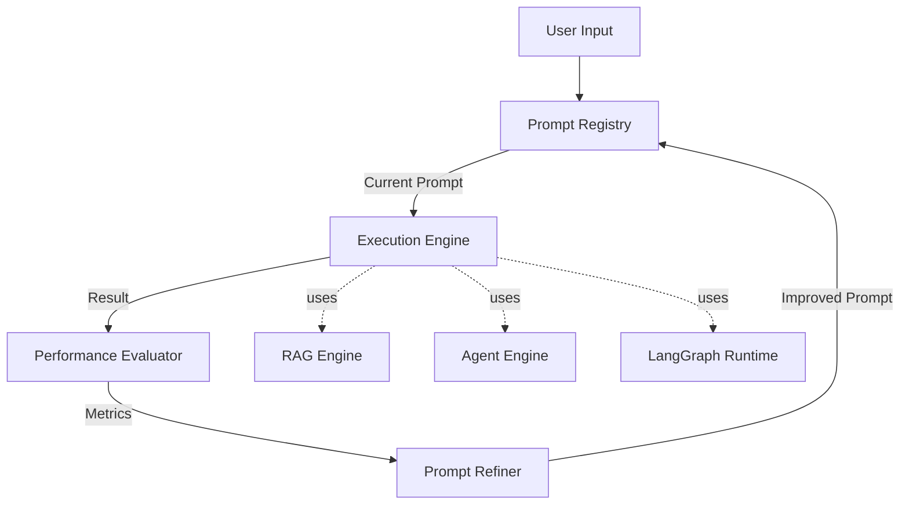

# 🧠 MCP Engine - Meta-Circular Prompting

> **The self-improving brain that governs all AI components**

## Overview

The MCP (Meta-Circular Prompting) Engine is the **central nervous system** of the AI Engine Platform. Unlike traditional static prompt systems, MCP creates a feedback loop where prompts continuously evolve based on performance metrics, user feedback, and system behavior.

## Core Concept

**Meta-Circular** means the system uses AI to improve its own AI prompts:

```
Prompt v1.0 → Execute → Evaluate → Learn → Prompt v1.1 → Execute → ...
```

Every interaction makes the system smarter.

---

## Architecture



---

## Key Components

### 1. Prompt Registry

**Version-controlled prompt storage:**

```python
class PromptRegistry:
    def __init__(self):
        self.prompts = {}  # {prompt_id: [versions]}
        self.active_versions = {}  # {prompt_id: version}
    
    def get_prompt(self, prompt_id: str) -> Prompt:
        """Get current active prompt"""
        version = self.active_versions[prompt_id]
        return self.prompts[prompt_id][version]
    
    def save_version(self, prompt_id: str, prompt: Prompt):
        """Save new prompt version"""
        self.prompts[prompt_id].append(prompt)
        self.active_versions[prompt_id] = len(self.prompts[prompt_id]) - 1
    
    def rollback(self, prompt_id: str, version: int):
        """Rollback to previous version"""
        self.active_versions[prompt_id] = version
```

**Features:**

- ✅ Git-like versioning
- ✅ Diff visualization
- ✅ Rollback capability
- ✅ A/B testing support

---

### 2. Execution Engine

**Runs prompts across different contexts:**

```python
class ExecutionEngine:
    def execute(self, prompt: Prompt, context: dict) -> Result:
        """
        Execute prompt with given context
        
        Args:
            prompt: Current prompt version
            context: User input, RAG context, agent state, etc.
        
        Returns:
            Result with output, metadata, and execution trace
        """
        # Inject context into prompt
        filled_prompt = prompt.fill(context)
        
        # Execute via appropriate engine
        if prompt.type == "rag":
            output = self.rag_engine.query(filled_prompt)
        elif prompt.type == "agent":
            output = self.agent_engine.execute(filled_prompt)
        elif prompt.type == "langgraph":
            output = self.langgraph_runtime.run(filled_prompt)
        
        return Result(
            output=output,
            prompt_version=prompt.version,
            execution_time=...,
            tokens_used=...,
            trace=...
        )
```

---

### 3. Performance Evaluator

**Measures prompt effectiveness:**

```python
class PerformanceEvaluator:
    def evaluate(self, result: Result, ground_truth: Optional[str] = None) -> Metrics:
        """
        Evaluate result quality
        
        Metrics:
        - Accuracy (if ground truth available)
        - Hallucination rate (for RAG)
        - Task completion (for agents)
        - User satisfaction (explicit feedback)
        - Latency
        - Cost (tokens)
        """
        metrics = {
            "accuracy": self._compute_accuracy(result, ground_truth),
            "hallucination_rate": self._detect_hallucinations(result),
            "completion_rate": self._check_task_completion(result),
            "latency": result.execution_time,
            "cost": result.tokens_used * TOKEN_COST,
            "user_feedback": result.user_rating  # 1-5 stars
        }
        
        # Composite score
        metrics["overall_score"] = self._weighted_average(metrics)
        
        return Metrics(**metrics)
```

**Evaluation Criteria:**

| Metric | Weight | Description |
|--------|--------|-------------|
| Accuracy | 30% | Correctness vs ground truth |
| Hallucination Rate | 25% | Claims without citations |
| Completion Rate | 20% | Task successfully finished |
| User Feedback | 15% | Explicit user rating |
| Latency | 5% | Response time |
| Cost | 5% | Token efficiency |

---

### 4. Prompt Refiner

**AI-powered prompt improvement:**

```python
class PromptRefiner:
    def refine(self, prompt: Prompt, metrics: Metrics, history: List[Result]) -> Prompt:
        """
        Generate improved prompt version
        
        Uses LLM to analyze:
        - Current prompt structure
        - Performance metrics
        - Failure patterns
        - Successful patterns
        
        Returns:
        - Refined prompt with explanations
        """
        analysis_prompt = f"""
        Current Prompt:
        {prompt.template}
        
        Performance Metrics:
        - Overall Score: {metrics.overall_score}
        - Hallucination Rate: {metrics.hallucination_rate}
        - Completion Rate: {metrics.completion_rate}
        
        Recent Failures:
        {self._extract_failures(history)}
        
        Recent Successes:
        {self._extract_successes(history)}
        
        Task: Improve this prompt to:
        1. Reduce hallucinations
        2. Increase task completion
        3. Maintain or improve accuracy
        
        Provide:
        - Refined prompt
        - Explanation of changes
        - Expected improvements
        """
        
        refined = self.llm.generate(analysis_prompt)
        
        return Prompt(
            template=refined.prompt,
            version=prompt.version + 1,
            parent_version=prompt.version,
            changes=refined.explanation,
            expected_improvements=refined.improvements
        )
```

---

## MCP Cycle in Detail

### Step 1: Input Arrives

```python
user_input = "Explain quantum computing"
context = {"domain": "physics", "user_level": "beginner"}
```

### Step 2: Retrieve Current Prompt

```python
prompt = registry.get_prompt("explain_concept")
# Version 3.2 (evolved from v1.0)
```

### Step 3: Execute

```python
result = executor.execute(prompt, {
    "input": user_input,
    "context": context
})
```

### Step 4: Evaluate

```python
metrics = evaluator.evaluate(result)
# overall_score: 0.82
# hallucination_rate: 0.05
# user_feedback: 4.5/5
```

### Step 5: Decide if Refinement Needed

```python
if metrics.overall_score < THRESHOLD or metrics.hallucination_rate > MAX_HALLUCINATION:
    # Trigger refinement
    new_prompt = refiner.refine(prompt, metrics, history)
    registry.save_version("explain_concept", new_prompt)
```

### Step 6: A/B Testing (Optional)

```python
# Test new version against current
ab_test = ABTest(
    variant_a=prompt,  # Current
    variant_b=new_prompt,  # New
    traffic_split=0.9  # 90% current, 10% new
)

# After N samples, promote if better
if ab_test.winner == variant_b:
    registry.activate_version("explain_concept", new_prompt.version)
```

---

## Integration with Other Components

### MCP → RAG Engine

**Controls retrieval strategy:**

```python
# MCP learns that for legal queries, need more context
rag_prompt = mcp.get_prompt("rag_legal")

# Evolved to:
"""
For legal queries:
1. Retrieve top 10 chunks (not 5)
2. Prioritize recent documents (< 2 years)
3. Require 3+ citations minimum
4. Use strict matching (not semantic)
"""
```

### MCP → Agent Engine

**Optimizes agent behavior:**

```python
# MCP detects agent often fails at step 3
agent_prompt = mcp.get_prompt("code_documentation_agent")

# Refined to:
"""
Step 3: Analyze code structure
- If analysis fails, retry with smaller scope
- If still fails, request human review
- Never proceed with incomplete analysis
"""
```

### MCP → LangGraph

**Evolves graph nodes:**

```python
# MCP notices confidence check threshold too strict
graph_node = mcp.get_prompt("confidence_check_node")

# Adjusted from:
# "if confidence < 0.9: retry"
# To:
# "if confidence < 0.75: retry"
```

### MCP → FT-Ops

**Triggers fine-tuning:**

```python
# MCP detects recurring pattern
if mcp.detect_pattern("sql_query_generation", min_occurrences=100):
    # Curate dataset
    dataset = mcp.extract_successful_examples("sql_query_generation")
    
    # Trigger FT-Ops
    ft_ops.queue_training(
        task="sql_query_generation",
        dataset=dataset,
        reason="Recurring pattern with 100+ examples"
    )
```

---

## Dashboard Features

### Prompt History View

```
Prompt: "explain_concept"

v3.2 (current) ⭐ Score: 0.87
├─ Changes: Added beginner-friendly examples
├─ Improvement: +12% user satisfaction
└─ Deployed: 2024-01-15

v3.1 ⚠️ Score: 0.75
├─ Changes: Reduced technical jargon
├─ Issue: Hallucination rate increased
└─ Rolled back after 2 days

v3.0 ✅ Score: 0.82
├─ Changes: Added citation requirements
└─ Stable for 30 days
```

### Diff Viewer

```diff
v3.1 → v3.2

- Explain {concept} in simple terms.
+ Explain {concept} in simple terms suitable for {user_level}.
+ 
+ Requirements:
+ - Use analogies from everyday life
+ - Avoid jargon unless explained
+ - Provide concrete examples
+ - Cite sources for technical claims
```

### Performance Trends

```
Prompt: "explain_concept"

Overall Score:
v1.0: 0.65 ████████░░
v2.0: 0.72 █████████░
v3.0: 0.82 ██████████
v3.2: 0.87 ███████████

Hallucination Rate:
v1.0: 0.25 ██████████
v2.0: 0.15 ██████░░░░
v3.0: 0.08 ███░░░░░░░
v3.2: 0.05 ██░░░░░░░░
```

---

## Configuration

```yaml
# mcp_config.yaml

registry:
  storage: "postgresql"  # or "filesystem", "s3"
  versioning: true
  max_versions_per_prompt: 50

evaluation:
  metrics:
    - accuracy
    - hallucination_rate
    - completion_rate
    - user_feedback
    - latency
    - cost
  
  thresholds:
    min_overall_score: 0.75
    max_hallucination_rate: 0.10
    min_completion_rate: 0.80

refinement:
  trigger:
    score_below: 0.75
    hallucination_above: 0.10
    after_n_failures: 5
  
  llm:
    model: "gpt-4"
    temperature: 0.3
    max_tokens: 2000

ab_testing:
  enabled: true
  traffic_split: 0.9  # 90% current, 10% new
  min_samples: 100
  confidence_level: 0.95
```

---

## Best Practices

### 1. Start Simple

```python
# v1.0 - Simple baseline
"Explain {concept}"

# Let MCP evolve it
# v2.0 - MCP adds structure
# v3.0 - MCP adds safeguards
# v4.0 - MCP optimizes for domain
```

### 2. Monitor Metrics

```python
# Set up alerts
if metrics.hallucination_rate > 0.15:
    alert("High hallucination rate detected")
    rollback_to_previous_version()
```

### 3. Human-in-the-Loop

```python
# Require approval for major changes
if prompt_diff.similarity < 0.7:
    require_human_approval()
```

### 4. Domain-Specific Prompts

```python
# Don't use one prompt for everything
prompts = {
    "legal": mcp.get_prompt("legal_query"),
    "medical": mcp.get_prompt("medical_query"),
    "code": mcp.get_prompt("code_query")
}
```

---

## API Reference

### Get Current Prompt

```python
GET /api/mcp/prompts/{prompt_id}

Response:
{
  "prompt_id": "explain_concept",
  "version": "3.2",
  "template": "...",
  "metrics": {
    "overall_score": 0.87,
    "hallucination_rate": 0.05
  }
}
```

### Execute with MCP

```python
POST /api/mcp/execute

Request:
{
  "prompt_id": "explain_concept",
  "input": "Explain quantum computing",
  "context": {"user_level": "beginner"}
}

Response:
{
  "output": "...",
  "prompt_version": "3.2",
  "metrics": {...},
  "citations": [...]
}
```

### Trigger Refinement

```python
POST /api/mcp/refine/{prompt_id}

Request:
{
  "reason": "High hallucination rate",
  "force": true
}

Response:
{
  "new_version": "3.3",
  "changes": "...",
  "expected_improvements": [...]
}
```

---

## Future Enhancements

- [ ] Multi-objective optimization (Pareto frontier)
- [ ] Federated learning across tenants
- [ ] Prompt marketplace (share successful prompts)
- [ ] Automatic prompt compression (reduce tokens)
- [ ] Cross-lingual prompt adaptation

---

## References

- [Prompt Engineering Guide](https://www.promptingguide.ai/)
- [Constitutional AI (Anthropic)](https://www.anthropic.com/index/constitutional-ai-harmlessness-from-ai-feedback)
- [RLHF (Reinforcement Learning from Human Feedback)](https://huggingface.co/blog/rlhf)

---

**MCP is the difference between using AI and building AI that builds better AI.**
