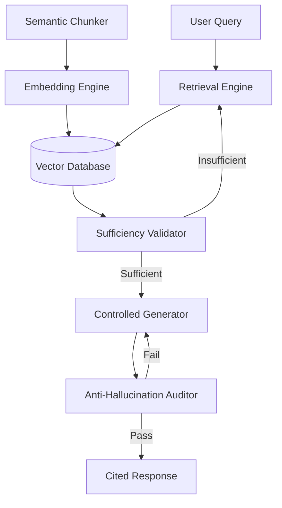

# 📚 RAG Engine - Anti-Hallucination Retrieval

> **Citation-backed, auditable responses with zero tolerance for hallucination**

## Overview

The RAG (Retrieval-Augmented Generation) Engine provides **factual, traceable responses** by grounding LLM outputs in verified source documents. Unlike traditional RAG systems, this implementation includes enterprise-grade anti-hallucination controls.

## Core Principles

1. **Every claim must be cited** - No unsupported statements
2. **Confidence scoring** - Quantify reliability (0.0-1.0)
3. **Semantic chunking** - Context-aware document splitting
4. **Sufficiency validation** - Ensure retrieved context is adequate
5. **Controlled generation** - LLM can only use provided context

---

## Architecture



---

## 5-Gate Execution Pipeline

### Gate 1: Semantic Chunking

**Context-aware document splitting:**

```python
class SemanticChunker:
    def chunk_document(self, document: Document) -> List[Chunk]:
        """
        Split document preserving semantic boundaries
        
        Strategy:
        - Respect section headers
        - Keep paragraphs intact
        - Maintain code blocks
        - Preserve tables
        - Add overlap for context continuity
        """
        chunks = []
        
        # Parse document structure
        sections = self._parse_sections(document)
        
        for section in sections:
            # Chunk by semantic units
            semantic_units = self._split_by_semantics(
                section,
                max_tokens=512,
                overlap_tokens=50
            )
            
            for unit in semantic_units:
                chunks.append(Chunk(
                    content=unit.text,
                    metadata={
                        "source": document.path,
                        "section": section.title,
                        "page": unit.page,
                        "line_range": unit.line_range,
                        "chunk_type": unit.type  # paragraph, code, table
                    },
                    embedding=None  # Computed next
                ))
        
        return chunks
```

**Chunking Strategies:**

| Document Type | Strategy | Chunk Size |
|---------------|----------|------------|
| Technical Docs | By section + overlap | 512 tokens |
| Code | By function/class | Variable |
| Legal | By clause | 256 tokens |
| Research Papers | By paragraph | 384 tokens |

---

### Gate 2: Embedding & Indexing

**Convert chunks to vector representations:**

```python
class EmbeddingEngine:
    def __init__(self, model: str = "text-embedding-3-large"):
        self.model = model
        self.dimension = 3072  # For text-embedding-3-large
    
    def embed_chunks(self, chunks: List[Chunk]) -> List[Chunk]:
        """Generate embeddings for chunks"""
        texts = [chunk.content for chunk in chunks]
        
        # Batch embedding for efficiency
        embeddings = self.client.embeddings.create(
            model=self.model,
            input=texts
        )
        
        for chunk, embedding in zip(chunks, embeddings.data):
            chunk.embedding = embedding.embedding
        
        return chunks
    
    def index_chunks(self, chunks: List[Chunk], namespace: str):
        """Store in vector database"""
        vectors = [
            {
                "id": chunk.id,
                "values": chunk.embedding,
                "metadata": chunk.metadata
            }
            for chunk in chunks
        ]
        
        self.vector_db.upsert(vectors, namespace=namespace)
```

---

### Gate 3: Retrieval & Ranking

**Find most relevant chunks:**

```python
class RetrievalEngine:
    def retrieve(self, query: str, top_k: int = 10) -> List[Chunk]:
        """
        Retrieve relevant chunks with hybrid search
        
        Combines:
        - Semantic similarity (vector search)
        - Keyword matching (BM25)
        - Recency (for time-sensitive queries)
        - Source authority (trusted docs ranked higher)
        """
        # Embed query
        query_embedding = self.embedder.embed(query)
        
        # Vector search
        semantic_results = self.vector_db.query(
            vector=query_embedding,
            top_k=top_k * 2,  # Over-retrieve for reranking
            include_metadata=True
        )
        
        # Keyword search
        keyword_results = self.bm25.search(query, top_k=top_k)
        
        # Hybrid fusion
        combined = self._reciprocal_rank_fusion(
            semantic_results,
            keyword_results
        )
        
        # Rerank by relevance + authority
        reranked = self._rerank(combined, query)
        
        return reranked[:top_k]
    
    def _reciprocal_rank_fusion(self, *result_lists) -> List[Chunk]:
        """Combine multiple ranking lists"""
        scores = defaultdict(float)
        
        for results in result_lists:
            for rank, chunk in enumerate(results, start=1):
                scores[chunk.id] += 1 / (rank + 60)  # RRF formula
        
        return sorted(scores.items(), key=lambda x: x[1], reverse=True)
```

---

### Gate 4: Sufficiency Validation

**Ensure retrieved context is adequate:**

```python
class SufficiencyValidator:
    def validate(self, query: str, chunks: List[Chunk]) -> ValidationResult:
        """
        Check if retrieved chunks can answer query
        
        Validation checks:
        1. Coverage: Do chunks contain relevant information?
        2. Completeness: Is information sufficient?
        3. Consistency: Do chunks contradict each other?
        4. Freshness: Is information up-to-date?
        """
        validation_prompt = f"""
        Query: {query}
        
        Retrieved Context:
        {self._format_chunks(chunks)}
        
        Evaluate:
        1. Can this context fully answer the query? (yes/no/partial)
        2. What information is missing? (if any)
        3. Are there contradictions? (yes/no)
        4. Confidence score (0.0-1.0)
        
        Respond in JSON format.
        """
        
        result = self.llm.generate(validation_prompt)
        
        if result.can_answer == "no":
            return ValidationResult(
                sufficient=False,
                reason=result.missing_info,
                action="expand_search"
            )
        
        if result.contradictions:
            return ValidationResult(
                sufficient=False,
                reason="Contradictory information found",
                action="resolve_conflicts"
            )
        
        return ValidationResult(
            sufficient=True,
            confidence=result.confidence
        )
```

---

### Gate 5: Controlled Generation

**Generate response using ONLY retrieved context:**

```python
class ControlledGenerator:
    def generate(self, query: str, chunks: List[Chunk]) -> Response:
        """
        Generate response with strict grounding
        
        Rules:
        - Use ONLY information from chunks
        - Cite every claim
        - If uncertain, say so
        - Never extrapolate beyond context
        """
        generation_prompt = f"""
        You are a factual assistant. Answer ONLY using the provided context.
        
        STRICT RULES:
        1. Every claim MUST be cited with [source:chunk_id]
        2. If context doesn't contain the answer, say "Information not available in provided context"
        3. Never use external knowledge
        4. Never extrapolate or infer beyond what's explicitly stated
        
        Query: {query}
        
        Context:
        {self._format_chunks_with_ids(chunks)}
        
        Provide:
        - Answer (with inline citations)
        - Confidence score (0.0-1.0)
        - List of cited chunk IDs
        """
        
        response = self.llm.generate(generation_prompt)
        
        return Response(
            answer=response.answer,
            confidence=response.confidence,
            citations=self._extract_citations(response, chunks),
            chunks_used=chunks
        )
```

---

## Anti-Hallucination Auditor

**Final validation before output:**

```python
class AntiHallucinationAuditor:
    def audit(self, response: Response) -> AuditResult:
        """
        Verify response is fully grounded
        
        Checks:
        1. Every sentence has citation
        2. Citations are valid
        3. Claims match source content
        4. No external knowledge used
        """
        issues = []
        
        # Check 1: Citation coverage
        sentences = self._split_sentences(response.answer)
        for sentence in sentences:
            if not self._has_citation(sentence):
                issues.append(f"Uncited claim: {sentence}")
        
        # Check 2: Citation validity
        for citation in response.citations:
            if not self._citation_exists(citation, response.chunks_used):
                issues.append(f"Invalid citation: {citation}")
        
        # Check 3: Content verification
        for sentence in sentences:
            citations = self._extract_citations_from_sentence(sentence)
            if not self._verify_claim(sentence, citations, response.chunks_used):
                issues.append(f"Unverified claim: {sentence}")
        
        if issues:
            return AuditResult(
                passed=False,
                issues=issues,
                action="regenerate"
            )
        
        return AuditResult(passed=True)
    
    def _verify_claim(self, claim: str, citations: List[str], chunks: List[Chunk]) -> bool:
        """Verify claim is supported by cited chunks"""
        cited_chunks = [c for c in chunks if c.id in citations]
        
        verification_prompt = f"""
        Claim: {claim}
        
        Source Content:
        {self._format_chunks(cited_chunks)}
        
        Is the claim directly supported by the source content?
        Answer: yes/no
        """
        
        result = self.llm.generate(verification_prompt)
        return result.answer.lower() == "yes"
```

---

## Output Format

### Standard Response

```json
{
  "answer": "Quantum computing uses quantum bits (qubits) that can exist in superposition [1]. Unlike classical bits that are either 0 or 1, qubits can be both simultaneously [1]. This enables quantum computers to process multiple possibilities in parallel [2].",
  "confidence": 0.91,
  "citations": [
    {
      "id": "1",
      "source": "quantum_computing_intro.pdf",
      "page": 5,
      "excerpt": "Qubits leverage superposition, existing as both 0 and 1 simultaneously..."
    },
    {
      "id": "2",
      "source": "quantum_computing_intro.pdf",
      "page": 7,
      "excerpt": "Parallel processing of quantum states allows..."
    }
  ],
  "metadata": {
    "chunks_retrieved": 10,
    "chunks_used": 3,
    "retrieval_time_ms": 45,
    "generation_time_ms": 1200,
    "total_tokens": 850
  }
}
```

### Insufficient Context Response

```json
{
  "answer": "Information not available in provided context",
  "confidence": 0.0,
  "reason": "No documents contain information about quantum entanglement applications in cryptography",
  "suggestions": [
    "Upload documents about quantum cryptography",
    "Expand search to include related topics"
  ]
}
```

---

## MCP Integration

**MCP governs RAG strategy evolution:**

```python
class MCPGoverned RAGEngine:
    def execute_query(self, query: str) -> Response:
        # Get current RAG strategy from MCP
        strategy = self.mcp.get_prompt("rag_strategy")
        
        # Apply MCP-evolved parameters
        chunks = self.retriever.retrieve(
            query,
            top_k=strategy.top_k,  # MCP may adjust based on query type
            filters=strategy.filters,  # MCP may add domain filters
            rerank=strategy.rerank_model  # MCP may switch reranker
        )
        
        # Generate with MCP-evolved prompt
        generation_prompt = self.mcp.get_prompt("rag_generation")
        response = self.generator.generate(query, chunks, generation_prompt)
        
        # Audit
        audit = self.auditor.audit(response)
        
        # Feedback to MCP
        self.mcp.record_execution(
            prompt_id="rag_strategy",
            metrics={
                "confidence": response.confidence,
                "citation_coverage": audit.citation_coverage,
                "hallucination_detected": not audit.passed
            }
        )
        
        return response
```

**MCP Learning Examples:**

```python
# MCP learns: Legal queries need more chunks
if query_domain == "legal":
    top_k = 15  # Increased from 10

# MCP learns: Code queries need exact matching
if query_domain == "code":
    use_keyword_search_weight = 0.7  # Increased from 0.3

# MCP learns: Medical queries need recent docs
if query_domain == "medical":
    recency_boost = 2.0  # Prioritize docs < 1 year old
```

---

## Configuration

```yaml
# rag_config.yaml

chunking:
  strategy: "semantic"
  max_chunk_size: 512
  overlap: 50
  respect_boundaries: true

embedding:
  model: "text-embedding-3-large"
  dimension: 3072
  batch_size: 100

retrieval:
  top_k: 10
  hybrid_search:
    semantic_weight: 0.7
    keyword_weight: 0.3
  reranking:
    enabled: true
    model: "cross-encoder/ms-marco-MiniLM-L-12-v2"

generation:
  model: "gpt-4-turbo"
  temperature: 0.1  # Low for factual responses
  max_tokens: 1000
  citation_format: "[{id}]"

validation:
  sufficiency_check: true
  anti_hallucination_audit: true
  min_confidence: 0.7
  max_retries: 3

vector_db:
  provider: "pinecone"  # or "weaviate", "qdrant"
  index_name: "ai-engine-rag"
  metric: "cosine"
```

---

## Best Practices

### 1. Document Preparation

```python
# ✅ Good: Clean, structured documents
documents = [
    Document(
        content=clean_text,
        metadata={
            "source": "official_docs.pdf",
            "date": "2024-01-15",
            "authority": "high",
            "verified": True
        }
    )
]

# ❌ Bad: Raw, unstructured text
documents = [Document(content=raw_html)]
```

### 2. Query Preprocessing

```python
# Expand acronyms
query = expand_acronyms(query)

# Add domain context
if user_domain:
    query = f"[Domain: {user_domain}] {query}"

# Detect intent
intent = classify_intent(query)  # factual, procedural, comparative
```

### 3. Citation Formatting

```python
# ✅ Good: Inline citations
"Quantum computers use qubits [1] that leverage superposition [2]."

# ❌ Bad: End-of-text citations
"Quantum computers use qubits that leverage superposition. [1][2]"
```

### 4. Confidence Calibration

```python
# Adjust confidence based on:
- Number of supporting chunks
- Consistency across sources
- Recency of information
- Source authority

confidence = (
    chunk_support_score * 0.4 +
    consistency_score * 0.3 +
    recency_score * 0.2 +
    authority_score * 0.1
)
```

---

## API Reference

### Index Documents

```python
POST /api/rag/index

Request:
{
  "documents": [
    {
      "content": "...",
      "metadata": {
        "source": "doc.pdf",
        "date": "2024-01-15"
      }
    }
  ],
  "namespace": "legal_docs"
}

Response:
{
  "indexed": 150,
  "chunks_created": 1200,
  "namespace": "legal_docs"
}
```

### Query

```python
POST /api/rag/query

Request:
{
  "query": "What are the requirements for GDPR compliance?",
  "namespace": "legal_docs",
  "top_k": 10
}

Response:
{
  "answer": "...",
  "confidence": 0.91,
  "citations": [...],
  "metadata": {...}
}
```

---

## Metrics & Monitoring

### Key Metrics

| Metric | Target | Alert Threshold |
|--------|--------|-----------------|
| Citation Coverage | 100% | < 95% |
| Hallucination Rate | 0% | > 5% |
| Avg Confidence | > 0.8 | < 0.7 |
| Retrieval Latency | < 100ms | > 200ms |
| Generation Latency | < 2s | > 5s |

### Dashboard

```
RAG Engine Health

Citation Coverage:    ████████████ 98%
Hallucination Rate:   █░░░░░░░░░░░  2%
Avg Confidence:       ██████████░░ 0.85
Retrieval Latency:    ████░░░░░░░░ 75ms
Generation Latency:   ██████░░░░░░ 1.2s

Recent Queries: 1,247
Failed Audits: 3 (0.24%)
```

---

## Future Enhancements

- [ ] Multi-modal RAG (images, tables, charts)
- [ ] Cross-lingual retrieval
- [ ] Temporal reasoning (time-aware queries)
- [ ] Graph-based RAG (knowledge graphs)
- [ ] Federated RAG (multi-source)

---

**RAG Engine: Truth, not hallucination. Citations, not guesses.**
