# 🛡️ Defensive Security Engine (DSE)

> **Continuous security testing + auto-correction without real attacks**

## Overview

The Defensive Security Engine (DSE) provides **enterprise-grade security testing** that simulates vulnerability classes, validates defensive controls, and auto-corrects issues—all without executing real exploits or malicious payloads.

## Core Principles

1. **❌ No real attacks** - Never execute exploits
2. **✅ Defensive validation** - Test controls, not vulnerabilities
3. **🤖 Auto-correction** - Generate fixes automatically
4. **📊 Continuous monitoring** - Always-on security posture
5. **🧠 MCP-governed** - Learn and improve over time

---

## Architecture


---

## OWASP Top 10 Coverage

### 1️⃣ SQL Injection (A03:2021)

**❌ What we DON'T do:**

```python
# NEVER execute real SQL injection payloads
payloads = ["' OR '1'='1", "'; DROP TABLE users--"]
```

**✅ What we DO:**

```python
class SQLInjectionDefenseValidator:
    """
    Validates SQL injection defenses WITHOUT attacks
    """
    
    def test_parameterized_queries(self, db_client):
        """
        Ensure ALL queries use parameterization
        
        Contract-based testing (safe)
        """
        queries = db_client.get_recent_queries(limit=1000)
        
        violations = []
        for query in queries:
            if not query.is_parameterized:
                violations.append({
                    "query": query.text,
                    "location": query.source_file,
                    "line": query.line_number,
                    "severity": "CRITICAL"
                })
        
        assert len(violations) == 0, \
            f"Found {len(violations)} non-parameterized queries"
        
        return TestResult(
            passed=len(violations) == 0,
            violations=violations
        )
    
    def test_orm_usage(self, codebase):
        """
        Ensure ORM is used (not raw SQL)
        
        Static analysis (safe)
        """
        raw_sql_patterns = [
            r'execute\s*\(',
            r'executemany\s*\(',
            r'cursor\.execute',
            r'db\.query\s*\('
        ]
        
        violations = []
        for file in codebase.python_files:
            for pattern in raw_sql_patterns:
                matches = grep_search(file, pattern)
                for match in matches:
                    # Check if it's parameterized
                    if not self._is_safe_usage(match):
                        violations.append({
                            "file": file,
                            "line": match.line_number,
                            "code": match.line_content
                        })
        
        return TestResult(
            passed=len(violations) == 0,
            violations=violations
        )
    
    def test_input_validation(self, api_endpoints):
        """
        Ensure input validation exists
        
        Policy check (safe)
        """
        for endpoint in api_endpoints:
            if endpoint.accepts_user_input:
                assert endpoint.has_input_validation, \
                    f"Endpoint {endpoint.path} lacks input validation"
                
                assert endpoint.has_type_checking, \
                    f"Endpoint {endpoint.path} lacks type checking"
```

**Auto-Fix Generation:**

```python
class SQLInjectionAutoFix:
    def generate_fix(self, violation: Violation) -> Fix:
        """
        Generate PR to fix SQL injection vulnerability
        """
        if violation.type == "non_parameterized_query":
            return Fix(
                file=violation.file,
                line=violation.line,
                original=violation.code,
                fixed=self._convert_to_parameterized(violation.code),
                explanation="Converted to parameterized query to prevent SQL injection"
            )
    
    def _convert_to_parameterized(self, code: str) -> str:
        """
        Convert string concatenation to parameterized query
        
        Example:
        Before: f"SELECT * FROM users WHERE id = {user_id}"
        After:  "SELECT * FROM users WHERE id = ?", (user_id,)
        """
        # AST-based transformation
        tree = ast.parse(code)
        transformer = ParameterizeTransformer()
        new_tree = transformer.visit(tree)
        return ast.unparse(new_tree)
```

---

### 2️⃣ Broken Authentication (A07:2021)

**✅ Defensive Tests:**

```python
class AuthenticationDefenseValidator:
    def test_password_requirements(self, auth_system):
        """Validate password policy"""
        policy = auth_system.get_password_policy()
        
        assert policy.min_length >= 12, "Password too short"
        assert policy.requires_uppercase, "Must require uppercase"
        assert policy.requires_lowercase, "Must require lowercase"
        assert policy.requires_numbers, "Must require numbers"
        assert policy.requires_special_chars, "Must require special chars"
    
    def test_session_management(self, auth_system):
        """Validate session security"""
        session_config = auth_system.get_session_config()
        
        assert session_config.http_only is True, "Sessions must be HTTP-only"
        assert session_config.secure is True, "Sessions must be Secure"
        assert session_config.same_site == "Strict", "SameSite must be Strict"
        assert session_config.timeout <= 3600, "Session timeout too long"
    
    def test_mfa_enforcement(self, auth_system):
        """Ensure MFA is available"""
        assert auth_system.supports_mfa, "MFA not supported"
        
        # Check if enforced for admin roles
        admin_users = auth_system.get_users(role="admin")
        for user in admin_users:
            assert user.mfa_enabled, f"Admin {user.email} lacks MFA"
    
    def test_rate_limiting(self, auth_endpoints):
        """Validate rate limiting on auth endpoints"""
        for endpoint in auth_endpoints:
            assert endpoint.has_rate_limit, \
                f"Endpoint {endpoint.path} lacks rate limiting"
            
            assert endpoint.rate_limit <= 5, \
                f"Rate limit too permissive: {endpoint.rate_limit}/min"
```

---

### 3️⃣ XSS (Cross-Site Scripting) (A03:2021)

**✅ Defensive Tests:**

```python
class XSSDefenseValidator:
    def test_output_encoding(self, render_functions):
        """Ensure all output is encoded"""
        for func in render_functions:
            # Check if output goes through encoding
            assert func.uses_auto_escape, \
                f"Function {func.name} doesn't auto-escape output"
    
    def test_csp_headers(self, web_server):
        """Validate Content Security Policy"""
        csp = web_server.get_csp_header()
        
        assert csp is not None, "CSP header missing"
        assert "default-src 'self'" in csp, "CSP too permissive"
        assert "script-src" in csp, "script-src not defined"
        assert "'unsafe-inline'" not in csp, "Unsafe inline scripts allowed"
    
    def test_sanitization(self, input_handlers):
        """Ensure input sanitization"""
        for handler in input_handlers:
            if handler.accepts_html:
                assert handler.uses_sanitizer, \
                    f"Handler {handler.name} accepts HTML but doesn't sanitize"
                
                # Check sanitizer config
                assert handler.sanitizer.strips_scripts, \
                    "Sanitizer doesn't strip scripts"
```

---

### 4️⃣ Broken Access Control (A01:2021)

**✅ Defensive Tests:**

```python
class AccessControlDefenseValidator:
    def test_acl_enforcement(self, api_client):
        """
        Test access control WITHOUT real attacks
        
        Uses test users with known permissions
        """
        # Test: Regular user can't access admin endpoint
        response = api_client.call_as(
            user="test_regular_user",
            endpoint="/admin/users",
            method="GET"
        )
        assert response.status_code in [401, 403], \
            "Regular user accessed admin endpoint"
        
        # Test: User can't access other user's data
        response = api_client.call_as(
            user="test_user_1",
            endpoint="/users/test_user_2/profile",
            method="GET"
        )
        assert response.status_code in [401, 403], \
            "User accessed another user's data"
    
    def test_rbac_configuration(self, rbac_system):
        """Validate RBAC is properly configured"""
        roles = rbac_system.get_all_roles()
        
        for role in roles:
            # Ensure principle of least privilege
            assert len(role.permissions) <= role.max_permissions, \
                f"Role {role.name} has too many permissions"
            
            # Ensure no wildcard permissions (except for admin)
            if role.name != "admin":
                assert "*" not in role.permissions, \
                    f"Role {role.name} has wildcard permission"
    
    def test_default_deny(self, api_endpoints):
        """Ensure default-deny policy"""
        for endpoint in api_endpoints:
            assert endpoint.requires_auth is True, \
                f"Endpoint {endpoint.path} doesn't require auth"
            
            assert endpoint.has_acl_check is True, \
                f"Endpoint {endpoint.path} lacks ACL check"
```

---

### 5️⃣ Security Misconfiguration (A05:2021)

**✅ Defensive Tests:**

```python
class SecurityConfigValidator:
    def test_debug_mode(self, app_config):
        """Ensure debug mode is off in production"""
        if app_config.environment == "production":
            assert app_config.debug is False, \
                "Debug mode enabled in production"
    
    def test_error_messages(self, app_config):
        """Ensure error messages don't leak info"""
        assert app_config.detailed_errors is False, \
            "Detailed errors enabled (info leak)"
    
    def test_security_headers(self, web_server):
        """Validate security headers"""
        headers = web_server.get_default_headers()
        
        required_headers = {
            "X-Content-Type-Options": "nosniff",
            "X-Frame-Options": "DENY",
            "X-XSS-Protection": "1; mode=block",
            "Strict-Transport-Security": "max-age=31536000"
        }
        
        for header, expected_value in required_headers.items():
            assert header in headers, f"Missing header: {header}"
            assert headers[header] == expected_value, \
                f"Incorrect {header}: {headers[header]}"
    
    def test_dependencies(self, project):
        """Check for vulnerable dependencies"""
        vulnerabilities = safety_check(project.requirements)
        
        critical = [v for v in vulnerabilities if v.severity == "CRITICAL"]
        assert len(critical) == 0, \
            f"Found {len(critical)} critical vulnerabilities"
```

---

## Safe Fuzzing

**Test input handling WITHOUT malicious payloads:**

```python
class SafeFuzzer:
    """
    Fuzzing with safe, non-malicious inputs
    
    Tests boundary conditions, not exploits
    """
    
    def generate_safe_inputs(self, input_type: str) -> List[Any]:
        """
        Generate edge cases for testing
        
        NOT attack payloads
        """
        if input_type == "string":
            return [
                "",  # Empty
                "a",  # Single char
                "A" * 1024,  # Long string
                "çãõñ",  # Unicode
                "  spaces  ",  # Whitespace
                "line\nbreak",  # Newlines
                "tab\there",  # Tabs
            ]
        
        elif input_type == "integer":
            return [
                0,
                1,
                -1,
                2**31 - 1,  # Max int32
                2**31,  # Overflow int32
                -2**31,  # Min int32
            ]
        
        elif input_type == "email":
            return [
                "valid@example.com",
                "no-at-sign",
                "@no-local-part.com",
                "no-domain@",
                "multiple@@at.com",
            ]
    
    def fuzz_endpoint(self, endpoint: APIEndpoint):
        """
        Test endpoint with safe fuzzing
        """
        results = []
        
        for param in endpoint.parameters:
            inputs = self.generate_safe_inputs(param.type)
            
            for input_value in inputs:
                response = endpoint.call({param.name: input_value})
                
                # Check for crashes, 500 errors, info leaks
                results.append(FuzzResult(
                    input=input_value,
                    status_code=response.status_code,
                    crashed=response.status_code == 500,
                    leaked_info=self._detect_info_leak(response)
                ))
        
        return results
```

---

## LangGraph Auto-Correction Loop

**Automated fix workflow:**

```mermaid
graph TB
    Test[Run Security Tests]
    Detect{Vulnerabilities Found?}
    Classify[Classify by OWASP]
    MCP[MCP Suggests Fix]
    Generate[Generate Auto-Fix]
    PR[Create Pull Request]
    Review{Human Review}
    Apply[Apply Fix]
    Retest[Re-run Tests]
    
    Test --> Detect
    Detect -->|No| OK[✅ All Clear]
    Detect -->|Yes| Classify
    Classify --> MCP
    MCP --> Generate
    Generate --> PR
    PR --> Review
    Review -->|Approved| Apply
    Review -->|Rejected| Manual[Manual Fix]
    Apply --> Retest
    Retest --> Test
```



**Implementation:**

```python
class SecurityCorrectionGraph:
    def __init__(self):
        self.graph = StateGraph(SecurityState)
        
        # Define nodes
        self.graph.add_node("test", self.run_tests)
        self.graph.add_node("classify", self.classify_vulnerabilities)
        self.graph.add_node("generate_fix", self.generate_auto_fix)
        self.graph.add_node("create_pr", self.create_pull_request)
        self.graph.add_node("retest", self.retest_after_fix)
        
        # Define edges
        self.graph.add_conditional_edges(
            "test",
            self.has_vulnerabilities,
            {
                True: "classify",
                False: END
            }
        )
        
        self.graph.add_edge("classify", "generate_fix")
        self.graph.add_edge("generate_fix", "create_pr")
        self.graph.add_edge("create_pr", "retest")
        self.graph.add_edge("retest", "test")  # Loop
    
    def run_tests(self, state: SecurityState) -> SecurityState:
        """Run all security tests"""
        results = self.orchestrator.run_all_tests()
        state.test_results = results
        return state
    
    def has_vulnerabilities(self, state: SecurityState) -> bool:
        """Check if any tests failed"""
        return any(not r.passed for r in state.test_results)
    
    def classify_vulnerabilities(self, state: SecurityState) -> SecurityState:
        """Classify by OWASP category"""
        for result in state.test_results:
            if not result.passed:
                result.owasp_category = self.classifier.classify(result)
        return state
    
    def generate_auto_fix(self, state: SecurityState) -> SecurityState:
        """Generate fixes using MCP"""
        fixes = []
        for result in state.test_results:
            if not result.passed:
                # Ask MCP for fix suggestion
                fix = self.mcp.suggest_fix(
                    vulnerability=result,
                    category=result.owasp_category
                )
                fixes.append(fix)
        
        state.proposed_fixes = fixes
        return state
    
    def create_pull_request(self, state: SecurityState) -> SecurityState:
        """Create PR with fixes"""
        pr = self.git.create_pr(
            title=f"[Security] Auto-fix {len(state.proposed_fixes)} vulnerabilities",
            body=self._format_pr_body(state.proposed_fixes),
            changes=state.proposed_fixes
        )
        state.pr_url = pr.url
        return state
```

---

## MCP Integration

**Learning from security patterns:**

```python
class MCPSecurityLearning:
    def learn_from_vulnerabilities(self, vulnerability_history: List[Vulnerability]):
        """
        MCP learns common vulnerability patterns
        
        Improves:
        - Code generation prompts (avoid insecure patterns)
        - Review prompts (catch issues earlier)
        - Fix prompts (better auto-corrections)
        """
        patterns = self._extract_patterns(vulnerability_history)
        
        for pattern in patterns:
            if pattern.frequency > 10:
                # Update code generation prompt
                self.mcp.update_prompt(
                    "code_generation",
                    add_rule=f"Never use {pattern.antipattern}. Use {pattern.secure_alternative} instead."
                )
                
                # Update review prompt
                self.mcp.update_prompt(
                    "code_review",
                    add_check=f"Flag usage of {pattern.antipattern}"
                )
    
    def _extract_patterns(self, history: List[Vulnerability]) -> List[Pattern]:
        """
        Find recurring vulnerability patterns
        
        Example:
        - String concatenation in SQL queries (10 occurrences)
        - Missing input validation (15 occurrences)
        - Hardcoded secrets (5 occurrences)
        """
        pattern_counts = defaultdict(int)
        
        for vuln in history:
            pattern = self._identify_pattern(vuln)
            pattern_counts[pattern] += 1
        
        return [
            Pattern(
                antipattern=pattern,
                frequency=count,
                secure_alternative=self._get_secure_alternative(pattern)
            )
            for pattern, count in pattern_counts.items()
        ]
```

---

## FT-Ops Integration

**Fine-tune models to write secure code:**

```python
class SecurityFTOps:
    def trigger_security_training(self):
        """
        When MCP detects recurring security issues,
        fine-tune model to write secure code by default
        """
        # Curate dataset
        dataset = []
        
        for vulnerability in self.vulnerability_history:
            dataset.append({
                "insecure_code": vulnerability.original_code,
                "secure_code": vulnerability.fixed_code,
                "explanation": vulnerability.fix_explanation,
                "owasp_category": vulnerability.owasp_category
            })
        
        # Fine-tune
        if len(dataset) >= 100:
            self.ft_ops.queue_training(
                task="secure_code_generation",
                dataset=dataset,
                base_model="gpt-4",
                epochs=3,
                validation_split=0.2
            )
```

---

## Dashboard

### Security Posture Overview

```
🛡️ Security Dashboard

OWASP Top 10 Coverage:
├─ A01 Broken Access Control    ✅ 100% (15/15 tests passed)
├─ A02 Cryptographic Failures    ✅ 100% (8/8 tests passed)
├─ A03 Injection                 ⚠️  95% (19/20 tests passed)
├─ A04 Insecure Design           ✅ 100% (12/12 tests passed)
├─ A05 Security Misconfiguration ✅ 100% (10/10 tests passed)
├─ A06 Vulnerable Components     ⚠️  90% (9/10 tests passed)
├─ A07 Auth Failures             ✅ 100% (14/14 tests passed)
├─ A08 Data Integrity Failures   ✅ 100% (6/6 tests passed)
├─ A09 Logging Failures          ✅ 100% (7/7 tests passed)
└─ A10 SSRF                      ✅ 100% (5/5 tests passed)

Overall Security Score: 97/100 🟢

Recent Activity:
├─ 2 vulnerabilities auto-fixed (PR #142)
├─ 1 vulnerability pending review (PR #143)
└─ 0 critical issues open

Trends (Last 30 Days):
├─ Vulnerabilities Found:    12 ↓ 40%
├─ Auto-Fix Success Rate:    92% ↑ 5%
└─ Mean Time to Fix:         2.3 hours ↓ 30%
```

---

## Configuration

```yaml
# security_config.yaml

testing:
  schedule: "0 */6 * * *"  # Every 6 hours
  on_commit: true
  on_pr: true

owasp_coverage:
  - A01_broken_access_control
  - A02_cryptographic_failures
  - A03_injection
  - A04_insecure_design
  - A05_security_misconfiguration
  - A06_vulnerable_components
  - A07_auth_failures
  - A08_data_integrity_failures
  - A09_logging_failures
  - A10_ssrf

auto_fix:
  enabled: true
  require_human_approval: true
  max_auto_fixes_per_pr: 10

alerts:
  critical_vulnerabilities:
    notify: ["security-team@company.com"]
    severity: "P0"
  
  failed_tests:
    notify: ["dev-team@company.com"]
    severity: "P2"

integrations:
  github:
    create_prs: true
    auto_assign_reviewers: ["security-lead", "tech-lead"]
  
  slack:
    channel: "#security-alerts"
    notify_on: ["critical", "high"]
```

---

## Best Practices

### 1. Never Execute Real Attacks

```python
# ❌ NEVER do this
def test_sql_injection():
    payload = "' OR '1'='1"
    db.execute(f"SELECT * FROM users WHERE id = {payload}")

# ✅ ALWAYS do this
def test_sql_injection_defense():
    assert db.uses_parameterized_queries()
```

### 2. Test Controls, Not Vulnerabilities

```python
# ❌ Don't test if system is vulnerable
def test_xss_vulnerability():
    response = inject_script("<script>alert('xss')</script>")
    assert "alert" not in response

# ✅ Test if controls exist
def test_xss_defense():
    assert output_encoder.is_enabled()
    assert csp_header.blocks_inline_scripts()
```

### 3. Automate Everything

```python
# Run tests continuously
@schedule.every(6).hours
def run_security_tests():
    results = orchestrator.run_all_tests()
    if results.has_failures():
        create_auto_fix_pr(results)
```

---

## API Reference

### Run Security Tests

```python
POST /api/security/test

Request:
{
  "scope": "all",  # or specific OWASP category
  "create_pr_on_failure": true
}

Response:
{
  "total_tests": 105,
  "passed": 102,
  "failed": 3,
  "score": 97,
  "failures": [
    {
      "category": "A03_injection",
      "test": "test_parameterized_queries",
      "severity": "HIGH",
      "auto_fix_available": true
    }
  ]
}
```

---

**Defensive Security Engine: Secure by design, validated by automation.**
